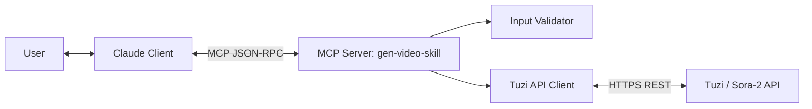
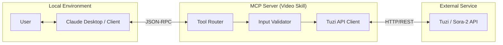


# 兔子 AI 视频生成 Claude Skill - 完整技术方案文档（MCP Server + Python）
> 版本：v1.0（整合版）
> 日期：2025-12-18
> 状态：可交付（建议评审后冻结）

> 本文档根据 `docs/Document integration plan.txt` 的整合策略，融合以下三份原始文档的优点：
> - `docs/tuzi-sora2-api-doc-Codex.md`（默认参数、轮询/重试、接口速览、合规提示）
> - `docs/tuzi-sora2-api-doc-Claude.md`（详尽的需求/实现/测试框架与矩阵）
> - `docs/tuzi-sora2-api-doc-Antigravity.md`（MCP Server 架构、Tool 定义、Mermaid 图）

> 重要说明：本文档“正文”为最终口径；附录 E 收录源文档仅用于审计与追溯，若存在冲突以正文为准。
---
## 目录
- 第一部分：项目概述与决策
- 第二部分：需求分析与功能设计
- 第三部分：MCP 架构设计
- 第四部分：实现细节（Python 参考实现）
- 第五部分：API 接口速览与示例
- 第六部分：测试与质量保证
- 第七部分：部署与交付
- 附录 A：参数/枚举/校验全集
- 附录 B：错误处理手册（分类 + 文案 + 动作）
- 附录 C：Prompt Cookbook（200+ 可复制示例）
- 附录 D：轮询/退避/超时策略参考
- 附录 E：源文档（逐字收录）
---
## 第一部分：项目概述与决策
### 1.1 项目背景与目标
本项目旨在为 Claude Skills 提供一个可交付、可审计、无二义性的“视频生成 Skill”，使 Claude 能够安全、稳定地调用兔子 AI（Tu-Zi.com）Sora-2 系列模型 API，实现端到端闭环：
- 生成：文生视频 / 图生视频 / 故事板多场景
- 角色：角色创建（提取）与客串一致性生成（必须包含）
- 编辑：Remix（基于已有任务或视频）
- 管理：状态查询、进度展示、超时处理
- 交付：视频链接透传 + 可选下载（按需）
### 1.2 范围与非范围
**范围（本期必须交付）**
- 使用 MCP Server 架构封装上游 Tuzi REST API
- 提供 5 个 MCP Tools：generate_video / get_video_status / remix_video / create_character / download_video
- 默认参数与轮询策略按“拍板口径”执行（见 1.3/3.3）
- 全量参数校验、错误映射、最小化日志与可观测性
**非范围（本期不做或可选）**
- 自建视频存储/CDN（默认不落地存储，仅透传 video_url）
- 多图参考（官方限制：仅 1 张）
- 自动图床上传（可作为扩展；本期优先 URL/Base64 传入）
- 大规模并发队列管理（本期仅做基础限流与稳态策略）
### 1.3 关键决策表（最终拍板口径）
| 决策项 | 最终方案 | 说明 |
|---|---|---|
| 架构模式 | MCP Server | 最适配 Claude Skills；工具化暴露能力给 LLM |
| 上游 API | Tuzi REST（官方优先） + Chat 作为补充 | 生成优先 `/v1/videos` multipart；Chat 用于补充（连续修改/图文对话） |
| 鉴权 | `Authorization: Bearer <TUZI_API_KEY>` | **环境变量注入**，严禁硬编码 |
| Base URL | `https://api.tu-zi.com` | 允许通过环境变量覆盖 |
| 默认模型 | `sora-2-pro` | 兼顾质量；支持 25s 标清 |
| 默认时长 | `15` 秒 | 用户不填则默认 15s |
| 默认尺寸 | 标清默认 `1280x720` | 用户不填 size 时；如用户明确“高清”且 pro，横屏用 `1792x1024`、竖屏用 `1024x1792` |
| 轮询策略 | 3→8s 递增，最长 8 分钟 | `GET /v1/videos/{id}`；推荐由 Claude 侧决定是否继续轮询 |
| 重试策略 | **仅** 5xx/网络重试 1 次 | 指数退避 2→4s；4xx/审查失败不重试 |
| 角色功能 | 必须包含 | 角色提取/复用 + 角色片段窗口校验（1~3s） |
| 水印/私有 | 默认 `watermark=false`、`private=false` | `private=false` 默认允许 remix |
| 输出交付 | 默认返回 `video_url` | 如需文件才调用 `/content`；不默认落地存储 |
| 配置方式 | 环境变量优先 + 可选配置文件 | 兼容本地调试/部署；正文以 env 为权威 |
### 1.4 术语表（Glossary）
- **task_id / video_id**：上游返回的任务标识（文档中可能混用；本文统一称 `task_id`，对应接口路径中的 `{video_id}`/`{id}`）。
- **Storyboard（故事板）**：在 prompt 中按分镜模板描述多个时间段的场景与动作。
- **Remix**：对已生成视频进行编辑（修改 prompt），输出新任务。
- **Character（角色一致性）**：从已完成任务提取角色，或在新生成时引用角色 URL/ID 保持人物一致。
---
## 第二部分：需求分析与功能设计
### 2.1 完整功能矩阵（包含角色功能）
| 编号 | 功能 | 优先级 | 工具入口 | 上游接口 | 说明 |
|---|---|---|---|---|---|
| F01 | 文生视频 | P0 | generate_video | POST /v1/videos | 仅文本 prompt 生成视频 |
| F02 | 图生视频 | P0 | generate_video | POST /v1/videos | `input_reference` 支持 URL/文件/Base64（推荐 URL） |
| F03 | 视频编辑 Remix | P1 | remix_video | POST /v1/videos/{id}/remix | 修改 prompt 输出新任务；要求原视频 `private=false` |
| F04 | 故事板多场景 | P1 | generate_video | POST /v1/videos | prompt 使用 storyboard 模板；时长与分镜时间轴一致 |
| F05 | 角色创建（提取） | P1 | create_character | POST /v1/videos | 从已完成任务提取角色，产出可复用的 `character_url`/`character_id` |
| F06 | 任务状态查询 | P0 | get_video_status | GET /v1/videos/{id} | 返回 queued/in_progress/completed/failed + progress + video_url |
| F07 | 视频下载 | P0 | download_video | GET /v1/videos/{id}/content | 默认返回 url；按需下载二进制/落盘（可选） |
| F08 | Chat 图文对话（可选） | P2 | （不强制暴露） | POST /v1/chat/completions | 作为补充能力，需在 prompt 中编码时长/比例等 |
### 2.2 用户故事与交互流程
#### 2.2.1 用户故事（示例）
| 场景 | 用户指令示例 | 期望系统行为 |
|---|---|---|
| 基础生成 | “生成一个 15 秒横屏的海边日落，电影质感。” | 调用 generate_video → 返回 task_id → 轮询 get_video_status → completed 后返回 video_url |
| 图生视频 | （用户上传图片）“让这张图里的猫跑起来，保持风格一致。” | 解析 input_reference → generate_video → 轮询 → 返回 video_url |
| 故事板 | “做一个 15 秒分镜：0-5s 城市航拍；5-10s 室内；10-15s 特写人物微笑。” | generate_video（storyboard 模式）→ 轮询 → 返回 video_url |
| 角色客串 | “记住上个视频里的兔子，让它在雪山上滑雪。” | create_character → generate_video（带 character_url + timestamps）→ 轮询 → 返回 video_url |
| Remix | “刚才视频太暗了，改成晴天阳光明媚。” | remix_video → 返回新 task_id → 轮询 → 返回新 video_url |
#### 2.2.2 端到端主流程（官方 multipart）
```
User → Claude → MCP(generate_video) → Tuzi POST /v1/videos
                           ← {task_id,status=queued}
         Claude → MCP(get_video_status) → Tuzi GET /v1/videos/{task_id}
                           ← {status=in_progress,progress}
         (repeat 3→8s until completed/failed or 8min timeout)
         Claude ← MCP(get_video_status) ← {status=completed,video_url}
User ← Claude: 返回视频链接/下一步操作建议
```
### 2.3 参数规范与校验（关键规则汇总）
#### 2.3.1 模型/时长/尺寸（默认策略）
- 模型：`sora-2` 或 `sora-2-pro`
- seconds：默认 15；可选 10/15/25（**25 仅 pro 支持**）
- size：默认 1280x720；竖屏可选 720x1280；高清仅 pro 支持 1792x1024/1024x1792
**尺寸与模型支持矩阵**
| size | 方向 | sora-2 | sora-2-pro |
|---|---|---:|---:|
| 1280x720 | 横屏标清 | ✅ | ✅ |
| 720x1280 | 竖屏标清 | ✅ | ✅ |
| 1792x1024 | 横屏高清 | ❌ | ✅ |
| 1024x1792 | 竖屏高清 | ❌ | ✅ |
#### 2.3.2 input_reference（图生视频）
- 官方限制：仅 1 张参考图
- 输入形式建议优先级：URL（http/https） > Base64 > 本地文件路径（若 MCP 运行环境允许读取）
- 合规风险：图片含真人/像真人/敏感内容将导致审查失败（可能在生成后期失败）
#### 2.3.3 角色一致性（character_*）
- 角色提取：从已完成任务 `character_from_task=<task_id>`，并提供 `character_timestamps="start,end"`
- 角色客串：生成新视频时提供 `character_url`（或 `character_id`/URL）与 `character_timestamps`
- 时间窗限制：`end-start` 必须在 **[1,3] 秒**
- 参考图限制：角色参考图仅支持 1 张（如上游支持）
#### 2.3.4 watermark/private/metadata
- watermark：默认 false（无水印）
- private：默认 false；若 true，可能无法 remix（按官方规则）
- metadata：透传给上游，便于追踪（建议写入 request_id/user_session 等，注意去敏）
### 2.4 技术约束与内容合规
#### 2.4.1 内容合规（必须对用户提示）
- 禁止：真人或像真人、暴力血腥、色情、恐怖主义、侵权内容、在世名人等（以平台审查为准）
- 三阶段审查：素材审查 → prompt 审查 → 生成结果复审；可能在 90%+ 进度失败属于正常
- Skill 侧必须：不给出绕过审查的建议；对审查失败给出“改素材/改提示词”的可操作建议
---
## 第三部分：MCP 架构设计
### 3.1 整体架构图（Mermaid）

### 3.2 MCP Tools 定义（JSON Schema）
> 说明：以下 schema 以“对 LLM 友好”为目标，字段命名采用业务语义；MCP Server 内部负责映射到上游字段（`seconds/size/input_reference/...`）。
#### 3.2.1 `generate_video`
- Description: 生成视频（文生/图生/故事板），返回 task_id。使用 get_video_status 轮询直到 completed/failed。
- Parameters:
```json
{
  "type": "object",
  "properties": {
    "prompt": {
      "type": "string",
      "description": "视频描述或故事板文本（storyboard=true 时使用分镜模板）"
    },
    "model": {
      "type": "string",
      "enum": [
        "sora-2",
        "sora-2-pro"
      ],
      "default": "sora-2-pro"
    },
    "seconds": {
      "type": "integer",
      "enum": [
        10,
        15,
        25
      ],
      "default": 15
    },
    "size": {
      "type": "string",
      "default": "1280x720",
      "description": "例如 1280x720, 720x1280, 1792x1024, 1024x1792"
    },
    "quality": {
      "type": "string",
      "enum": [
        "sd",
        "hd",
        "auto"
      ],
      "default": "auto",
      "description": "用户语义偏好：sd/hd/auto；auto 时由默认策略决定"
    },
    "storyboard": {
      "type": "boolean",
      "default": false,
      "description": "是否为故事板模式"
    },
    "input_reference_url": {
      "type": "string",
      "description": "参考图 URL（推荐）"
    },
    "input_reference_base64": {
      "type": "string",
      "description": "参考图 Base64（备选）"
    },
    "watermark": {
      "type": "boolean",
      "default": false
    },
    "private": {
      "type": "boolean",
      "default": false
    },
    "character_create": {
      "type": "boolean",
      "default": false,
      "description": "是否在生成后自动创建角色（如上游支持）"
    },
    "character_url": {
      "type": "string",
      "description": "角色引用 URL/ID（用于客串）"
    },
    "character_from_task": {
      "type": "string",
      "description": "从某个已完成任务提取角色（与 create_character 互补）"
    },
    "character_timestamps": {
      "type": "string",
      "description": "\"start,end\"，end-start 需在 1~3 秒"
    },
    "metadata": {
      "type": "object",
      "description": "透传元数据（去敏）"
    }
  },
  "required": [
    "prompt"
  ],
  "additionalProperties": false
}
```
- Examples:
```json
[
  {
    "prompt": "15 秒横屏：电影质感的海边日落，慢速推进镜头",
    "model": "sora-2-pro",
    "seconds": 15,
    "size": "1280x720"
  },
  {
    "prompt": "Storyboard:\nShot1 (0-5s): ...\nShot2 (5-10s): ...\nShot3 (10-15s): ...",
    "storyboard": true
  }
]
```
#### 3.2.2 `get_video_status`
- Description: 查询任务状态（queued/in_progress/completed/failed）及进度，返回 video_url（若完成）。
- Parameters:
```json
{
  "type": "object",
  "properties": {
    "task_id": {
      "type": "string",
      "description": "任务 ID，例如 sora-2:task_..."
    }
  },
  "required": [
    "task_id"
  ],
  "additionalProperties": false
}
```
- Examples:
```json
[
  {
    "task_id": "sora-2:task_xxxxx"
  }
]
```
#### 3.2.3 `remix_video`
- Description: Remix 编辑已有视频，返回新的 task_id。
- Parameters:
```json
{
  "type": "object",
  "properties": {
    "task_id": {
      "type": "string",
      "description": "原任务/视频 ID"
    },
    "prompt": {
      "type": "string",
      "description": "新的提示词（编辑指令）"
    }
  },
  "required": [
    "task_id",
    "prompt"
  ],
  "additionalProperties": false
}
```
- Examples:
```json
[
  {
    "task_id": "sora-2:task_xxxxx",
    "prompt": "把场景改成白天、阳光更强、色彩更明亮"
  }
]
```
#### 3.2.4 `create_character`
- Description: 从已完成任务提取角色并返回 character_url（用于后续一致性生成）。
- Parameters:
```json
{
  "type": "object",
  "properties": {
    "source_task_id": {
      "type": "string",
      "description": "源任务 ID（必须 completed）"
    },
    "model": {
      "type": "string",
      "enum": [
        "sora-2",
        "sora-2-pro"
      ],
      "default": "sora-2-pro"
    },
    "character_timestamps": {
      "type": "string",
      "description": "\"start,end\"，end-start 需在 1~3 秒"
    }
  },
  "required": [
    "source_task_id",
    "character_timestamps"
  ],
  "additionalProperties": false
}
```
- Examples:
```json
[
  {
    "source_task_id": "sora-2:task_xxxxx",
    "character_timestamps": "1,3"
  }
]
```
#### 3.2.5 `download_video`
- Description: 下载视频内容（默认返回 video_url；按需拉取 /content）。
- Parameters:
```json
{
  "type": "object",
  "properties": {
    "task_id": {
      "type": "string"
    },
    "mode": {
      "type": "string",
      "enum": [
        "url",
        "bytes",
        "file"
      ],
      "default": "url"
    },
    "output_path": {
      "type": "string",
      "description": "mode=file 时写入路径（可选）"
    }
  },
  "required": [
    "task_id"
  ],
  "additionalProperties": false
}
```
- Examples:
```json
[
  {
    "task_id": "sora-2:task_xxxxx",
    "mode": "url"
  }
]
```
### 3.3 异步轮询机制（默认：3→8s 递增，8 分钟超时）
#### 3.3.1 轮询节奏（建议）
| 轮询次数 n | 等待秒数 | 说明 |
|---:|---:|---|
| 1 | 3 | 任务创建后首次查询 |
| 2 | 4 | 若仍 in_progress/queued |
| 3 | 5 | 逐步退让，降低 QPS |
| 4 | 6 |  |
| 5 | 7 |  |
| 6+ | 8 | 固定 8 秒直到超时 |
#### 3.3.2 超时策略
- 总超时：8 分钟（480 秒）
- 超时返回：向用户返回 task_id，并提示“可稍后继续查询”
- 轮询责任：MCP Server 可提供 helper，但最终由 Claude 侧决定是否继续轮询（避免阻塞对话）
### 3.4 重试机制（默认：仅网络/5xx 重试 1 次）
#### 3.4.1 可重试分类
| 场景 | 是否重试 | 次数 | 退避 |
|---|---:|---:|---|
| 网络错误/连接超时 | ✅ | 1 | 2 秒后重试 |
| 5xx（上游服务异常） | ✅ | 1 | 4 秒后重试（或 2→4s 指数退避） |
| 429（限流） | ❌（默认） | 0 | 返回提示并建议稍后再试/延长轮询间隔 |
| 4xx 参数错误 | ❌ | 0 | 直接返回字段级错误提示 |
| 审查失败（status=failed 或特定错误） | ❌ | 0 | 提示改素材/改提示词 |
### 3.5 日志、观测与隐私
- 日志必须去敏：不记录 API Key、Base64 原图、不记录完整 prompt（可记录哈希/摘要）
- 建议记录：request_id、task_id、status 流转、耗时、错误分类、重试次数、轮询次数
- 指标建议：成功率、平均耗时、审查失败率、5xx 率、重试率、轮询次数分布
---
## 第四部分：实现细节（Python 参考实现）
### 4.1 推荐目录结构（MCP Skill）
```
gen-video-skill/
├─ SKILL.md                      # Skill 说明（触发、工具、示例、合规）
├─ server/
│  ├─ mcp_server.py               # MCP Server 入口（注册工具）
│  ├─ config_manager.py           # 环境变量/配置文件加载
│  ├─ api_client.py               # Tuzi API Client（httpx）
│  ├─ validators.py               # 参数校验与默认策略
│  ├─ polling.py                  # 轮询/超时/退避
│  ├─ exceptions.py               # 统一异常类型
│  └─ tools/
│     ├─ generate_video.py
│     ├─ get_video_status.py
│     ├─ remix_video.py
│     ├─ create_character.py
│     └─ download_video.py
├─ references/
│  ├─ api.md                      # 上游接口速览（本文第 5 部分可拆分）
│  └─ policy.md                   # 合规提示与用户声明模板
└─ tests/                         # 可选：pytest + respx
```
### 4.2 配置管理（环境变量优先 + 可选配置文件）
#### 4.2.1 必需环境变量
- `TUZI_API_KEY`：上游 API Key（必填）
#### 4.2.2 可选环境变量（建议）
- `TUZI_BASE_URL`：默认 `https://api.tu-zi.com`
- `TUZI_DEFAULT_MODEL`：默认 `sora-2-pro`
- `TUZI_DEFAULT_SECONDS`：默认 `15`
- `TUZI_DEFAULT_SIZE`：默认 `1280x720`
- `TUZI_HTTP_TIMEOUT_SECONDS`：默认 `60`（建议 read 超时更长）
- `TUZI_LOG_LEVEL`：默认 `INFO`
#### 4.2.3 可选配置文件（本地调试用）
> 若提供配置文件，必须明确：环境变量优先生效（覆盖配置文件）。
```json
{
  "api_key": "${TUZI_API_KEY}",
  "base_url": "https://api.tu-zi.com",
  "defaults": {
    "model": "sora-2-pro",
    "seconds": 15,
    "size": "1280x720",
    "watermark": false,
    "private": false
  },
  "network": {
    "timeout_seconds": 60,
    "retry_on_5xx": 1,
    "retry_backoff_seconds": [2, 4],
    "polling_schedule_seconds": [3, 4, 5, 6, 7, 8],
    "polling_timeout_seconds": 480
  }
}
```
### 4.3 上游 API 调用要点（multipart / JSON）
- `/v1/videos` 推荐使用 multipart/form-data：字段包括 `model`、`prompt`、`seconds`、`size`、`input_reference`、`watermark`、`private`、`character_*` 等
- `/v1/videos/{id}/remix` 为 JSON：`{"prompt": "..."}`
- `/v1/videos/{id}` 为查询状态，返回 status/progress/video_url 等
- `/v1/videos/{id}/content` 返回二进制视频内容（按需）
### 4.4 参考实现片段（MCP Server 注册工具示例）
> 说明：以下示例以常见 MCP Python SDK 写法展示结构；实际函数/装饰器名以你使用的 SDK 版本为准。
```python
from __future__ import annotations
import os
from typing import Any, Optional
# 示例：from mcp.server.fastmcp import FastMCP
# mcp = FastMCP("gen-video-skill")
from api_client import TuziApiClient
from validators import normalize_and_validate_generate_args
client = TuziApiClient(api_key=os.environ["TUZI_API_KEY"], base_url=os.getenv("TUZI_BASE_URL", "https://api.tu-zi.com"))
# @mcp.tool()
async def generate_video(**kwargs: Any) -> dict:
    args = normalize_and_validate_generate_args(kwargs)
    task = await client.create_video_task(**args)
    return {"task_id": task["id"], "status": task.get("status", "queued"), "progress": task.get("progress", 0)}
# @mcp.tool()
async def get_video_status(task_id: str) -> dict:
    task = await client.get_video_task(task_id)
    return {
        "task_id": task.get("id", task_id),
        "status": task.get("status"),
        "progress": task.get("progress"),
        "video_url": task.get("video_url"),
        "error": task.get("error"),
    }
# @mcp.tool()
async def remix_video(task_id: str, prompt: str) -> dict:
    new_task = await client.remix_video(task_id=task_id, prompt=prompt)
    return {"task_id": new_task["id"], "status": new_task.get("status", "queued")}
# @mcp.tool()
async def create_character(source_task_id: str, character_timestamps: str, model: str = "sora-2-pro") -> dict:
    character = await client.create_character_from_task(
        source_task_id=source_task_id,
        character_timestamps=character_timestamps,
        model=model,
    )
    return character
# @mcp.tool()
async def download_video(task_id: str, mode: str = "url", output_path: Optional[str] = None) -> dict:
    if mode == "url":
        task = await client.get_video_task(task_id)
        return {"task_id": task_id, "video_url": task.get("video_url")}
    if mode == "bytes":
        data = await client.download_video_bytes(task_id)
        return {"task_id": task_id, "bytes_base64": data}  # 注意：可能很大，谨慎使用
    if mode == "file":
        path = await client.download_video_file(task_id, output_path)
        return {"task_id": task_id, "file_path": path}
    raise ValueError("invalid mode")
```
### 4.5 角色功能：推荐交互策略（LLM 侧提示）
- 当用户说“记住这个角色/保持人物一致/让同一个人再次出现”时：优先调用 `create_character` 获取 `character_url`。
- 在后续 `generate_video` 中传入 `character_url` 与 `character_timestamps`。
- 若用户不关心一致性：不要强制创建角色（默认 `character_create=false`）。
---
## 第五部分：API 接口速览与示例
### 5.1 接口速览表（官方优先）
| 能力 | Method | Path | 要点 |
|---|---|---|---|
| 生成/故事板/自动角色/角色提取 | POST | /v1/videos | multipart：model, prompt, seconds, size, input_reference?, watermark?, private?, character_*?, metadata |
| 查询 | GET | /v1/videos/{id} | status, progress, video_url 等 |
| 下载 | GET | /v1/videos/{id}/content | 二进制视频内容 |
| Remix | POST | /v1/videos/{id}/remix | JSON：{ prompt } |
| Chat（可选） | POST | /v1/chat/completions | JSON：model, messages, stream?；支持 image_url |
### 5.2 请求示例（curl）
#### 5.2.1 文生视频（multipart）
```bash
curl -X POST "https://api.tu-zi.com/v1/videos" \
  -H "Authorization: Bearer $TUZI_API_KEY" \
  -F "model=sora-2-pro" \
  -F "prompt=15秒横屏：电影质感的海边日落，慢速推进镜头" \
  -F "seconds=15" \
  -F "size=1280x720" \
  -F "watermark=false" \
  -F "private=false"
```
#### 5.2.2 图生视频（input_reference=URL）
```bash
curl -X POST "https://api.tu-zi.com/v1/videos" \
  -H "Authorization: Bearer $TUZI_API_KEY" \
  -F "model=sora-2-pro" \
  -F "prompt=让图中的猫奔跑起来，保持原本画风" \
  -F "seconds=15" \
  -F "size=1280x720" \
  -F "input_reference=https://example.com/cat.png"
```
#### 5.2.3 角色提取（从任务创建角色）
```bash
curl -X POST "https://api.tu-zi.com/v1/videos" \
  -H "Authorization: Bearer $TUZI_API_KEY" \
  -F "model=sora-2-pro" \
  -F "character_from_task=sora-2:task_xxxxx" \
  -F "character_timestamps=1,3"
```
#### 5.2.4 查询状态
```bash
curl -X GET "https://api.tu-zi.com/v1/videos/sora-2:task_xxxxx" \
  -H "Authorization: Bearer $TUZI_API_KEY"
```
#### 5.2.5 Remix
```bash
curl -X POST "https://api.tu-zi.com/v1/videos/sora-2:task_xxxxx/remix" \
  -H "Authorization: Bearer $TUZI_API_KEY" \
  -H "Content-Type: application/json" \
  -d "{\"prompt\": \"把场景改成白天、色彩更明亮\"}"
```
### 5.3 响应字段（最小字段集）
- `id`：任务 ID
- `status`：queued / in_progress / completed / failed
- `progress`：0~100（若提供）
- `video_url`：完成后的视频地址
- `error`：失败原因（若提供）
---
## 第六部分：测试与质量保证
### 6.1 单元测试清单（建议）
| 模块 | 用例 | 预期 |
|---|---|---|
| validators | 默认参数填充（model/seconds/size） | 未填时按拍板口径补齐 |
| validators | seconds=25 仅 pro 支持 | 非 pro 报参数错误 |
| validators | size 与 model 兼容性 | 不兼容时报错并给可选值 |
| validators | character_timestamps 校验 | end-start ∈ [1,3] |
| api_client | 5xx/网络重试 1 次 | 第二次仍失败则抛错 |
| polling | 3→8s 节奏与 8 分钟超时 | 超时返回可查询信息 |
### 6.2 集成测试场景（建议）
1. 文生视频：创建 → 轮询 → 完成 → 返回链接
2. 图生视频：带 input_reference → 完成
3. 故事板：分镜 prompt → 完成
4. 角色提取：completed 任务 → create_character → 返回 character_url
5. 角色客串：generate_video 带 character_url + timestamps → 完成
6. Remix：原任务 private=false → remix → 完成
7. 错误：参数错误 400、鉴权 401、审查失败、5xx、下载失败
### 6.3 验收标准（摘要）
- 关键路径全部闭环：生成/查询/下载/编辑/角色/故事板
- 默认策略一致：pro+15s+1280x720，轮询 3→8s，超时 8 分钟，5xx/网络重试 1 次
- 错误可理解：对用户给出明确下一步（改提示词/改素材/稍后再试）
- 安全合规：API Key 仅 env；日志去敏；不提供绕过审查建议
---
## 第七部分：部署与交付
### 7.1 依赖建议
- Python 3.10+
- HTTP 客户端：`httpx`（建议 async）
- 配置：`pydantic`（可选）
- 测试：`pytest` + `respx`（可选）
### 7.2 运行方式（示例）
> 以 MCP Server 为例：
```bash
setx TUZI_API_KEY "YOUR_KEY"
setx TUZI_BASE_URL "https://api.tu-zi.com"
# 启动 MCP Server（命令以实际实现为准）
python -m server.mcp_server
```
### 7.3 交付物清单
- `SKILL.md`：用途、触发条件、工具说明、默认策略、合规声明、示例对话
- MCP Server 源码：工具实现 + 校验 + 客户端 + 错误映射
- `references/`：API 速览、参数指南、错误码手册
- （可选）`tests/`：单元/集成测试
---
## 附录 A：参数/枚举/校验全集
### A.1 枚举列表
- model：`sora-2` / `sora-2-pro`
- seconds：10 / 15 / 25（25 仅 pro）
- size：1280x720 / 720x1280 / 1792x1024 / 1024x1792（后两者仅 pro）
- status：queued / in_progress / completed / failed
- download.mode：url / bytes / file
### A.2 校验规则清单（逐条）
1. seconds=25 → model 必须是 sora-2-pro
2. size 属于高清（1792x1024/1024x1792）→ model 必须是 sora-2-pro
3. input_reference 同时提供 url 与 base64 时：优先 url，或视为参数冲突
4. character_timestamps 必须符合 "start,end" 且 end-start ∈ [1,3]
5. private=true 时：提示用户 remix 可能不可用
6. prompt 不能为空；storyboard=true 时建议校验包含 Shot/时间轴（宽松）
---
## 附录 B：错误处理手册（分类 + 文案 + 动作）
| 分类 | 典型来源 | 是否重试 | 用户文案模板 | 工程动作 |
|---|---|---:|---|---|
| 参数错误 | 400 | ❌ | “参数不合法：{field}。可选：{options}” | 回传字段级错误；提示更正 |
| 鉴权失败 | 401 | ❌ | “API Key 无效或未配置。请检查 TUZI_API_KEY。” | 立即失败；不重试 |
| 权限不足 | 403 | ❌ | “权限不足，无法访问该资源。” | 失败；提示联系服务方 |
| 资源不存在 | 404 | ❌ | “任务不存在或已过期：{task_id}” | 失败；建议核对 ID |
| 限流 | 429 | ❌（默认） | “请求过于频繁，请稍后再试。” | 建议延长轮询间隔 |
| 上游异常 | 5xx | ✅（1 次） | “服务繁忙，已自动重试；如仍失败请稍后再试。” | 2→4s 退避重试 1 次 |
| 网络异常 | timeout/conn | ✅（1 次） | “网络不稳定，已自动重试；如仍失败请稍后再试。” | 2→4s 退避重试 1 次 |
| 审查失败 | status=failed | ❌ | “内容审核未通过：{reason}。请修改素材/提示词。” | 失败；不给绕过建议 |
---
## 附录 C：Prompt Cookbook（200+ 可复制示例）
> 说明：以下示例用于快速产出高质量 prompt。建议在每条 prompt 中显式包含：主体/环境/风格/镜头/光照/时长/画幅。
### C.1 文生视频（横屏/竖屏）
- 15 秒横屏，电影质感：一只橘猫在海边日落，稳定手持跟拍，柔和漫射光，画面稳定，无水印。
- 15 秒横屏，电影质感：一只橘猫在雪山清晨，航拍俯视，强烈逆光，画面稳定，无水印。
- 15 秒横屏，电影质感：一只橘猫在雨夜的霓虹街道，环绕镜头，霓虹灯光，画面稳定，无水印。
- 15 秒横屏，电影质感：一只橘猫在森林薄雾中，特写拉近，烛光，画面稳定，无水印。
- 15 秒横屏，电影质感：一只橘猫在沙漠星空下，延时摄影，冷色调月光，画面稳定，无水印。
- 15 秒横屏，纪录片风格：一只橘猫在海边日落，低角度仰拍，室内暖光，画面稳定，无水印。
- 15 秒横屏，纪录片风格：一只橘猫在雪山清晨，景深明显，清晨蓝调，画面稳定，无水印。
- 15 秒横屏，纪录片风格：一只橘猫在雨夜的霓虹街道，镜头由远到近，雾气散射光，画面稳定，无水印。
- 15 秒横屏，纪录片风格：一只橘猫在森林薄雾中，镜头切换三次，高对比光影，画面稳定，无水印。
- 15 秒横屏，纪录片风格：一只橘猫在沙漠星空下，慢速推进镜头，金色夕阳，画面稳定，无水印。
- 15 秒横屏，赛博朋克：一只橘猫在海边日落，稳定手持跟拍，柔和漫射光，画面稳定，无水印。
- 15 秒横屏，赛博朋克：一只橘猫在雪山清晨，航拍俯视，强烈逆光，画面稳定，无水印。
- 15 秒横屏，赛博朋克：一只橘猫在雨夜的霓虹街道，环绕镜头，霓虹灯光，画面稳定，无水印。
- 15 秒横屏，赛博朋克：一只橘猫在森林薄雾中，特写拉近，烛光，画面稳定，无水印。
- 15 秒横屏，赛博朋克：一只橘猫在沙漠星空下，延时摄影，冷色调月光，画面稳定，无水印。
- 15 秒横屏，日系清新：一只橘猫在海边日落，低角度仰拍，室内暖光，画面稳定，无水印。
- 15 秒横屏，日系清新：一只橘猫在雪山清晨，景深明显，清晨蓝调，画面稳定，无水印。
- 15 秒横屏，日系清新：一只橘猫在雨夜的霓虹街道，镜头由远到近，雾气散射光，画面稳定，无水印。
- 15 秒横屏，日系清新：一只橘猫在森林薄雾中，镜头切换三次，高对比光影，画面稳定，无水印。
- 15 秒横屏，日系清新：一只橘猫在沙漠星空下，慢速推进镜头，金色夕阳，画面稳定，无水印。
- 15 秒横屏，复古胶片：一只橘猫在海边日落，稳定手持跟拍，柔和漫射光，画面稳定，无水印。
- 15 秒横屏，复古胶片：一只橘猫在雪山清晨，航拍俯视，强烈逆光，画面稳定，无水印。
- 15 秒横屏，复古胶片：一只橘猫在雨夜的霓虹街道，环绕镜头，霓虹灯光，画面稳定，无水印。
- 15 秒横屏，复古胶片：一只橘猫在森林薄雾中，特写拉近，烛光，画面稳定，无水印。
- 15 秒横屏，复古胶片：一只橘猫在沙漠星空下，延时摄影，冷色调月光，画面稳定，无水印。
- 15 秒横屏，电影质感：一只兔子在海边日落，低角度仰拍，室内暖光，画面稳定，无水印。
- 15 秒横屏，电影质感：一只兔子在雪山清晨，景深明显，清晨蓝调，画面稳定，无水印。
- 15 秒横屏，电影质感：一只兔子在雨夜的霓虹街道，镜头由远到近，雾气散射光，画面稳定，无水印。
- 15 秒横屏，电影质感：一只兔子在森林薄雾中，镜头切换三次，高对比光影，画面稳定，无水印。
- 15 秒横屏，电影质感：一只兔子在沙漠星空下，慢速推进镜头，金色夕阳，画面稳定，无水印。
- 15 秒横屏，纪录片风格：一只兔子在海边日落，稳定手持跟拍，柔和漫射光，画面稳定，无水印。
- 15 秒横屏，纪录片风格：一只兔子在雪山清晨，航拍俯视，强烈逆光，画面稳定，无水印。
- 15 秒横屏，纪录片风格：一只兔子在雨夜的霓虹街道，环绕镜头，霓虹灯光，画面稳定，无水印。
- 15 秒横屏，纪录片风格：一只兔子在森林薄雾中，特写拉近，烛光，画面稳定，无水印。
- 15 秒横屏，纪录片风格：一只兔子在沙漠星空下，延时摄影，冷色调月光，画面稳定，无水印。
- 15 秒横屏，赛博朋克：一只兔子在海边日落，低角度仰拍，室内暖光，画面稳定，无水印。
- 15 秒横屏，赛博朋克：一只兔子在雪山清晨，景深明显，清晨蓝调，画面稳定，无水印。
- 15 秒横屏，赛博朋克：一只兔子在雨夜的霓虹街道，镜头由远到近，雾气散射光，画面稳定，无水印。
- 15 秒横屏，赛博朋克：一只兔子在森林薄雾中，镜头切换三次，高对比光影，画面稳定，无水印。
- 15 秒横屏，赛博朋克：一只兔子在沙漠星空下，慢速推进镜头，金色夕阳，画面稳定，无水印。
- 15 秒横屏，日系清新：一只兔子在海边日落，稳定手持跟拍，柔和漫射光，画面稳定，无水印。
- 15 秒横屏，日系清新：一只兔子在雪山清晨，航拍俯视，强烈逆光，画面稳定，无水印。
- 15 秒横屏，日系清新：一只兔子在雨夜的霓虹街道，环绕镜头，霓虹灯光，画面稳定，无水印。
- 15 秒横屏，日系清新：一只兔子在森林薄雾中，特写拉近，烛光，画面稳定，无水印。
- 15 秒横屏，日系清新：一只兔子在沙漠星空下，延时摄影，冷色调月光，画面稳定，无水印。
- 15 秒横屏，复古胶片：一只兔子在海边日落，低角度仰拍，室内暖光，画面稳定，无水印。
- 15 秒横屏，复古胶片：一只兔子在雪山清晨，景深明显，清晨蓝调，画面稳定，无水印。
- 15 秒横屏，复古胶片：一只兔子在雨夜的霓虹街道，镜头由远到近，雾气散射光，画面稳定，无水印。
- 15 秒横屏，复古胶片：一只兔子在森林薄雾中，镜头切换三次，高对比光影，画面稳定，无水印。
- 15 秒横屏，复古胶片：一只兔子在沙漠星空下，慢速推进镜头，金色夕阳，画面稳定，无水印。
- 15 秒横屏，电影质感：一只熊猫在海边日落，稳定手持跟拍，柔和漫射光，画面稳定，无水印。
- 15 秒横屏，电影质感：一只熊猫在雪山清晨，航拍俯视，强烈逆光，画面稳定，无水印。
- 15 秒横屏，电影质感：一只熊猫在雨夜的霓虹街道，环绕镜头，霓虹灯光，画面稳定，无水印。
- 15 秒横屏，电影质感：一只熊猫在森林薄雾中，特写拉近，烛光，画面稳定，无水印。
- 15 秒横屏，电影质感：一只熊猫在沙漠星空下，延时摄影，冷色调月光，画面稳定，无水印。
- 15 秒横屏，纪录片风格：一只熊猫在海边日落，低角度仰拍，室内暖光，画面稳定，无水印。
- 15 秒横屏，纪录片风格：一只熊猫在雪山清晨，景深明显，清晨蓝调，画面稳定，无水印。
- 15 秒横屏，纪录片风格：一只熊猫在雨夜的霓虹街道，镜头由远到近，雾气散射光，画面稳定，无水印。
- 15 秒横屏，纪录片风格：一只熊猫在森林薄雾中，镜头切换三次，高对比光影，画面稳定，无水印。
- 15 秒横屏，纪录片风格：一只熊猫在沙漠星空下，慢速推进镜头，金色夕阳，画面稳定，无水印。
- 15 秒横屏，赛博朋克：一只熊猫在海边日落，稳定手持跟拍，柔和漫射光，画面稳定，无水印。
- 15 秒横屏，赛博朋克：一只熊猫在雪山清晨，航拍俯视，强烈逆光，画面稳定，无水印。
- 15 秒横屏，赛博朋克：一只熊猫在雨夜的霓虹街道，环绕镜头，霓虹灯光，画面稳定，无水印。
- 15 秒横屏，赛博朋克：一只熊猫在森林薄雾中，特写拉近，烛光，画面稳定，无水印。
- 15 秒横屏，赛博朋克：一只熊猫在沙漠星空下，延时摄影，冷色调月光，画面稳定，无水印。
- 15 秒横屏，日系清新：一只熊猫在海边日落，低角度仰拍，室内暖光，画面稳定，无水印。
- 15 秒横屏，日系清新：一只熊猫在雪山清晨，景深明显，清晨蓝调，画面稳定，无水印。
- 15 秒横屏，日系清新：一只熊猫在雨夜的霓虹街道，镜头由远到近，雾气散射光，画面稳定，无水印。
- 15 秒横屏，日系清新：一只熊猫在森林薄雾中，镜头切换三次，高对比光影，画面稳定，无水印。
- 15 秒横屏，日系清新：一只熊猫在沙漠星空下，慢速推进镜头，金色夕阳，画面稳定，无水印。
- 15 秒横屏，复古胶片：一只熊猫在海边日落，稳定手持跟拍，柔和漫射光，画面稳定，无水印。
- 15 秒横屏，复古胶片：一只熊猫在雪山清晨，航拍俯视，强烈逆光，画面稳定，无水印。
- 15 秒横屏，复古胶片：一只熊猫在雨夜的霓虹街道，环绕镜头，霓虹灯光，画面稳定，无水印。
- 15 秒横屏，复古胶片：一只熊猫在森林薄雾中，特写拉近，烛光，画面稳定，无水印。
- 15 秒横屏，复古胶片：一只熊猫在沙漠星空下，延时摄影，冷色调月光，画面稳定，无水印。
- 15 秒横屏，电影质感：一位宇航员在海边日落，低角度仰拍，室内暖光，画面稳定，无水印。
- 15 秒横屏，电影质感：一位宇航员在雪山清晨，景深明显，清晨蓝调，画面稳定，无水印。
- 15 秒横屏，电影质感：一位宇航员在雨夜的霓虹街道，镜头由远到近，雾气散射光，画面稳定，无水印。
- 15 秒横屏，电影质感：一位宇航员在森林薄雾中，镜头切换三次，高对比光影，画面稳定，无水印。
- 15 秒横屏，电影质感：一位宇航员在沙漠星空下，慢速推进镜头，金色夕阳，画面稳定，无水印。
- 15 秒横屏，纪录片风格：一位宇航员在海边日落，稳定手持跟拍，柔和漫射光，画面稳定，无水印。
- 15 秒横屏，纪录片风格：一位宇航员在雪山清晨，航拍俯视，强烈逆光，画面稳定，无水印。
- 15 秒横屏，纪录片风格：一位宇航员在雨夜的霓虹街道，环绕镜头，霓虹灯光，画面稳定，无水印。
- 15 秒横屏，纪录片风格：一位宇航员在森林薄雾中，特写拉近，烛光，画面稳定，无水印。
- 15 秒横屏，纪录片风格：一位宇航员在沙漠星空下，延时摄影，冷色调月光，画面稳定，无水印。
- 15 秒横屏，赛博朋克：一位宇航员在海边日落，低角度仰拍，室内暖光，画面稳定，无水印。
- 15 秒横屏，赛博朋克：一位宇航员在雪山清晨，景深明显，清晨蓝调，画面稳定，无水印。
- 15 秒横屏，赛博朋克：一位宇航员在雨夜的霓虹街道，镜头由远到近，雾气散射光，画面稳定，无水印。
- 15 秒横屏，赛博朋克：一位宇航员在森林薄雾中，镜头切换三次，高对比光影，画面稳定，无水印。
- 15 秒横屏，赛博朋克：一位宇航员在沙漠星空下，慢速推进镜头，金色夕阳，画面稳定，无水印。
- 15 秒横屏，日系清新：一位宇航员在海边日落，稳定手持跟拍，柔和漫射光，画面稳定，无水印。
- 15 秒横屏，日系清新：一位宇航员在雪山清晨，航拍俯视，强烈逆光，画面稳定，无水印。
- 15 秒横屏，日系清新：一位宇航员在雨夜的霓虹街道，环绕镜头，霓虹灯光，画面稳定，无水印。
- 15 秒横屏，日系清新：一位宇航员在森林薄雾中，特写拉近，烛光，画面稳定，无水印。
- 15 秒横屏，日系清新：一位宇航员在沙漠星空下，延时摄影，冷色调月光，画面稳定，无水印。
- 15 秒横屏，复古胶片：一位宇航员在海边日落，低角度仰拍，室内暖光，画面稳定，无水印。
- 15 秒横屏，复古胶片：一位宇航员在雪山清晨，景深明显，清晨蓝调，画面稳定，无水印。
- 15 秒横屏，复古胶片：一位宇航员在雨夜的霓虹街道，镜头由远到近，雾气散射光，画面稳定，无水印。
- 15 秒横屏，复古胶片：一位宇航员在森林薄雾中，镜头切换三次，高对比光影，画面稳定，无水印。
- 15 秒横屏，复古胶片：一位宇航员在沙漠星空下，慢速推进镜头，金色夕阳，画面稳定，无水印。
- 15 秒横屏，电影质感：一位骑士在海边日落，稳定手持跟拍，柔和漫射光，画面稳定，无水印。
- 15 秒横屏，电影质感：一位骑士在雪山清晨，航拍俯视，强烈逆光，画面稳定，无水印。
- 15 秒横屏，电影质感：一位骑士在雨夜的霓虹街道，环绕镜头，霓虹灯光，画面稳定，无水印。
- 15 秒横屏，电影质感：一位骑士在森林薄雾中，特写拉近，烛光，画面稳定，无水印。
- 15 秒横屏，电影质感：一位骑士在沙漠星空下，延时摄影，冷色调月光，画面稳定，无水印。
- 15 秒横屏，纪录片风格：一位骑士在海边日落，低角度仰拍，室内暖光，画面稳定，无水印。
- 15 秒横屏，纪录片风格：一位骑士在雪山清晨，景深明显，清晨蓝调，画面稳定，无水印。
- 15 秒横屏，纪录片风格：一位骑士在雨夜的霓虹街道，镜头由远到近，雾气散射光，画面稳定，无水印。
- 15 秒横屏，纪录片风格：一位骑士在森林薄雾中，镜头切换三次，高对比光影，画面稳定，无水印。
- 15 秒横屏，纪录片风格：一位骑士在沙漠星空下，慢速推进镜头，金色夕阳，画面稳定，无水印。
- 15 秒横屏，赛博朋克：一位骑士在海边日落，稳定手持跟拍，柔和漫射光，画面稳定，无水印。
- 15 秒横屏，赛博朋克：一位骑士在雪山清晨，航拍俯视，强烈逆光，画面稳定，无水印。
- 15 秒横屏，赛博朋克：一位骑士在雨夜的霓虹街道，环绕镜头，霓虹灯光，画面稳定，无水印。
- 15 秒横屏，赛博朋克：一位骑士在森林薄雾中，特写拉近，烛光，画面稳定，无水印。
- 15 秒横屏，赛博朋克：一位骑士在沙漠星空下，延时摄影，冷色调月光，画面稳定，无水印。
- 15 秒横屏，日系清新：一位骑士在海边日落，低角度仰拍，室内暖光，画面稳定，无水印。
- 15 秒横屏，日系清新：一位骑士在雪山清晨，景深明显，清晨蓝调，画面稳定，无水印。
- 15 秒横屏，日系清新：一位骑士在雨夜的霓虹街道，镜头由远到近，雾气散射光，画面稳定，无水印。
- 15 秒横屏，日系清新：一位骑士在森林薄雾中，镜头切换三次，高对比光影，画面稳定，无水印。
- 15 秒横屏，日系清新：一位骑士在沙漠星空下，慢速推进镜头，金色夕阳，画面稳定，无水印。
### C.2 图生视频（参考图 + 运动/表情/镜头）
- 参考图保持主体一致：让主体做出第 1 种自然动作（眨眼/转头/行走/挥手/跳跃等），镜头平稳，背景细节延展，15 秒。
- 参考图保持主体一致：让主体做出第 2 种自然动作（眨眼/转头/行走/挥手/跳跃等），镜头平稳，背景细节延展，15 秒。
- 参考图保持主体一致：让主体做出第 3 种自然动作（眨眼/转头/行走/挥手/跳跃等），镜头平稳，背景细节延展，15 秒。
- 参考图保持主体一致：让主体做出第 4 种自然动作（眨眼/转头/行走/挥手/跳跃等），镜头平稳，背景细节延展，15 秒。
- 参考图保持主体一致：让主体做出第 5 种自然动作（眨眼/转头/行走/挥手/跳跃等），镜头平稳，背景细节延展，15 秒。
- 参考图保持主体一致：让主体做出第 6 种自然动作（眨眼/转头/行走/挥手/跳跃等），镜头平稳，背景细节延展，15 秒。
- 参考图保持主体一致：让主体做出第 7 种自然动作（眨眼/转头/行走/挥手/跳跃等），镜头平稳，背景细节延展，15 秒。
- 参考图保持主体一致：让主体做出第 8 种自然动作（眨眼/转头/行走/挥手/跳跃等），镜头平稳，背景细节延展，15 秒。
- 参考图保持主体一致：让主体做出第 9 种自然动作（眨眼/转头/行走/挥手/跳跃等），镜头平稳，背景细节延展，15 秒。
- 参考图保持主体一致：让主体做出第 10 种自然动作（眨眼/转头/行走/挥手/跳跃等），镜头平稳，背景细节延展，15 秒。
- 参考图保持主体一致：让主体做出第 11 种自然动作（眨眼/转头/行走/挥手/跳跃等），镜头平稳，背景细节延展，15 秒。
- 参考图保持主体一致：让主体做出第 12 种自然动作（眨眼/转头/行走/挥手/跳跃等），镜头平稳，背景细节延展，15 秒。
- 参考图保持主体一致：让主体做出第 13 种自然动作（眨眼/转头/行走/挥手/跳跃等），镜头平稳，背景细节延展，15 秒。
- 参考图保持主体一致：让主体做出第 14 种自然动作（眨眼/转头/行走/挥手/跳跃等），镜头平稳，背景细节延展，15 秒。
- 参考图保持主体一致：让主体做出第 15 种自然动作（眨眼/转头/行走/挥手/跳跃等），镜头平稳，背景细节延展，15 秒。
- 参考图保持主体一致：让主体做出第 16 种自然动作（眨眼/转头/行走/挥手/跳跃等），镜头平稳，背景细节延展，15 秒。
- 参考图保持主体一致：让主体做出第 17 种自然动作（眨眼/转头/行走/挥手/跳跃等），镜头平稳，背景细节延展，15 秒。
- 参考图保持主体一致：让主体做出第 18 种自然动作（眨眼/转头/行走/挥手/跳跃等），镜头平稳，背景细节延展，15 秒。
- 参考图保持主体一致：让主体做出第 19 种自然动作（眨眼/转头/行走/挥手/跳跃等），镜头平稳，背景细节延展，15 秒。
- 参考图保持主体一致：让主体做出第 20 种自然动作（眨眼/转头/行走/挥手/跳跃等），镜头平稳，背景细节延展，15 秒。
- 参考图保持主体一致：让主体做出第 21 种自然动作（眨眼/转头/行走/挥手/跳跃等），镜头平稳，背景细节延展，15 秒。
- 参考图保持主体一致：让主体做出第 22 种自然动作（眨眼/转头/行走/挥手/跳跃等），镜头平稳，背景细节延展，15 秒。
- 参考图保持主体一致：让主体做出第 23 种自然动作（眨眼/转头/行走/挥手/跳跃等），镜头平稳，背景细节延展，15 秒。
- 参考图保持主体一致：让主体做出第 24 种自然动作（眨眼/转头/行走/挥手/跳跃等），镜头平稳，背景细节延展，15 秒。
- 参考图保持主体一致：让主体做出第 25 种自然动作（眨眼/转头/行走/挥手/跳跃等），镜头平稳，背景细节延展，15 秒。
- 参考图保持主体一致：让主体做出第 26 种自然动作（眨眼/转头/行走/挥手/跳跃等），镜头平稳，背景细节延展，15 秒。
- 参考图保持主体一致：让主体做出第 27 种自然动作（眨眼/转头/行走/挥手/跳跃等），镜头平稳，背景细节延展，15 秒。
- 参考图保持主体一致：让主体做出第 28 种自然动作（眨眼/转头/行走/挥手/跳跃等），镜头平稳，背景细节延展，15 秒。
- 参考图保持主体一致：让主体做出第 29 种自然动作（眨眼/转头/行走/挥手/跳跃等），镜头平稳，背景细节延展，15 秒。
- 参考图保持主体一致：让主体做出第 30 种自然动作（眨眼/转头/行走/挥手/跳跃等），镜头平稳，背景细节延展，15 秒。
- 参考图保持主体一致：让主体做出第 31 种自然动作（眨眼/转头/行走/挥手/跳跃等），镜头平稳，背景细节延展，15 秒。
- 参考图保持主体一致：让主体做出第 32 种自然动作（眨眼/转头/行走/挥手/跳跃等），镜头平稳，背景细节延展，15 秒。
- 参考图保持主体一致：让主体做出第 33 种自然动作（眨眼/转头/行走/挥手/跳跃等），镜头平稳，背景细节延展，15 秒。
- 参考图保持主体一致：让主体做出第 34 种自然动作（眨眼/转头/行走/挥手/跳跃等），镜头平稳，背景细节延展，15 秒。
- 参考图保持主体一致：让主体做出第 35 种自然动作（眨眼/转头/行走/挥手/跳跃等），镜头平稳，背景细节延展，15 秒。
- 参考图保持主体一致：让主体做出第 36 种自然动作（眨眼/转头/行走/挥手/跳跃等），镜头平稳，背景细节延展，15 秒。
- 参考图保持主体一致：让主体做出第 37 种自然动作（眨眼/转头/行走/挥手/跳跃等），镜头平稳，背景细节延展，15 秒。
- 参考图保持主体一致：让主体做出第 38 种自然动作（眨眼/转头/行走/挥手/跳跃等），镜头平稳，背景细节延展，15 秒。
- 参考图保持主体一致：让主体做出第 39 种自然动作（眨眼/转头/行走/挥手/跳跃等），镜头平稳，背景细节延展，15 秒。
- 参考图保持主体一致：让主体做出第 40 种自然动作（眨眼/转头/行走/挥手/跳跃等），镜头平稳，背景细节延展，15 秒。
- 参考图保持主体一致：让主体做出第 41 种自然动作（眨眼/转头/行走/挥手/跳跃等），镜头平稳，背景细节延展，15 秒。
- 参考图保持主体一致：让主体做出第 42 种自然动作（眨眼/转头/行走/挥手/跳跃等），镜头平稳，背景细节延展，15 秒。
- 参考图保持主体一致：让主体做出第 43 种自然动作（眨眼/转头/行走/挥手/跳跃等），镜头平稳，背景细节延展，15 秒。
- 参考图保持主体一致：让主体做出第 44 种自然动作（眨眼/转头/行走/挥手/跳跃等），镜头平稳，背景细节延展，15 秒。
- 参考图保持主体一致：让主体做出第 45 种自然动作（眨眼/转头/行走/挥手/跳跃等），镜头平稳，背景细节延展，15 秒。
- 参考图保持主体一致：让主体做出第 46 种自然动作（眨眼/转头/行走/挥手/跳跃等），镜头平稳，背景细节延展，15 秒。
- 参考图保持主体一致：让主体做出第 47 种自然动作（眨眼/转头/行走/挥手/跳跃等），镜头平稳，背景细节延展，15 秒。
- 参考图保持主体一致：让主体做出第 48 种自然动作（眨眼/转头/行走/挥手/跳跃等），镜头平稳，背景细节延展，15 秒。
- 参考图保持主体一致：让主体做出第 49 种自然动作（眨眼/转头/行走/挥手/跳跃等），镜头平稳，背景细节延展，15 秒。
- 参考图保持主体一致：让主体做出第 50 种自然动作（眨眼/转头/行走/挥手/跳跃等），镜头平稳，背景细节延展，15 秒。
- 参考图保持主体一致：让主体做出第 51 种自然动作（眨眼/转头/行走/挥手/跳跃等），镜头平稳，背景细节延展，15 秒。
- 参考图保持主体一致：让主体做出第 52 种自然动作（眨眼/转头/行走/挥手/跳跃等），镜头平稳，背景细节延展，15 秒。
- 参考图保持主体一致：让主体做出第 53 种自然动作（眨眼/转头/行走/挥手/跳跃等），镜头平稳，背景细节延展，15 秒。
- 参考图保持主体一致：让主体做出第 54 种自然动作（眨眼/转头/行走/挥手/跳跃等），镜头平稳，背景细节延展，15 秒。
- 参考图保持主体一致：让主体做出第 55 种自然动作（眨眼/转头/行走/挥手/跳跃等），镜头平稳，背景细节延展，15 秒。
- 参考图保持主体一致：让主体做出第 56 种自然动作（眨眼/转头/行走/挥手/跳跃等），镜头平稳，背景细节延展，15 秒。
- 参考图保持主体一致：让主体做出第 57 种自然动作（眨眼/转头/行走/挥手/跳跃等），镜头平稳，背景细节延展，15 秒。
- 参考图保持主体一致：让主体做出第 58 种自然动作（眨眼/转头/行走/挥手/跳跃等），镜头平稳，背景细节延展，15 秒。
- 参考图保持主体一致：让主体做出第 59 种自然动作（眨眼/转头/行走/挥手/跳跃等），镜头平稳，背景细节延展，15 秒。
- 参考图保持主体一致：让主体做出第 60 种自然动作（眨眼/转头/行走/挥手/跳跃等），镜头平稳，背景细节延展，15 秒。
### C.3 故事板（Storyboard）
- Storyboard 示例 1:
  - Shot 1 (0-5s): 建立镜头，交代环境与主体。
  - Shot 2 (5-10s): 动作展开，镜头跟随或环绕。
  - Shot 3 (10-15s): 情绪高潮或关键动作特写，最后 1 秒渐隐。
- Storyboard 示例 2:
  - Shot 1 (0-5s): 建立镜头，交代环境与主体。
  - Shot 2 (5-10s): 动作展开，镜头跟随或环绕。
  - Shot 3 (10-15s): 情绪高潮或关键动作特写，最后 1 秒渐隐。
- Storyboard 示例 3:
  - Shot 1 (0-5s): 建立镜头，交代环境与主体。
  - Shot 2 (5-10s): 动作展开，镜头跟随或环绕。
  - Shot 3 (10-15s): 情绪高潮或关键动作特写，最后 1 秒渐隐。
- Storyboard 示例 4:
  - Shot 1 (0-5s): 建立镜头，交代环境与主体。
  - Shot 2 (5-10s): 动作展开，镜头跟随或环绕。
  - Shot 3 (10-15s): 情绪高潮或关键动作特写，最后 1 秒渐隐。
- Storyboard 示例 5:
  - Shot 1 (0-5s): 建立镜头，交代环境与主体。
  - Shot 2 (5-10s): 动作展开，镜头跟随或环绕。
  - Shot 3 (10-15s): 情绪高潮或关键动作特写，最后 1 秒渐隐。
- Storyboard 示例 6:
  - Shot 1 (0-5s): 建立镜头，交代环境与主体。
  - Shot 2 (5-10s): 动作展开，镜头跟随或环绕。
  - Shot 3 (10-15s): 情绪高潮或关键动作特写，最后 1 秒渐隐。
- Storyboard 示例 7:
  - Shot 1 (0-5s): 建立镜头，交代环境与主体。
  - Shot 2 (5-10s): 动作展开，镜头跟随或环绕。
  - Shot 3 (10-15s): 情绪高潮或关键动作特写，最后 1 秒渐隐。
- Storyboard 示例 8:
  - Shot 1 (0-5s): 建立镜头，交代环境与主体。
  - Shot 2 (5-10s): 动作展开，镜头跟随或环绕。
  - Shot 3 (10-15s): 情绪高潮或关键动作特写，最后 1 秒渐隐。
- Storyboard 示例 9:
  - Shot 1 (0-5s): 建立镜头，交代环境与主体。
  - Shot 2 (5-10s): 动作展开，镜头跟随或环绕。
  - Shot 3 (10-15s): 情绪高潮或关键动作特写，最后 1 秒渐隐。
- Storyboard 示例 10:
  - Shot 1 (0-5s): 建立镜头，交代环境与主体。
  - Shot 2 (5-10s): 动作展开，镜头跟随或环绕。
  - Shot 3 (10-15s): 情绪高潮或关键动作特写，最后 1 秒渐隐。
- Storyboard 示例 11:
  - Shot 1 (0-5s): 建立镜头，交代环境与主体。
  - Shot 2 (5-10s): 动作展开，镜头跟随或环绕。
  - Shot 3 (10-15s): 情绪高潮或关键动作特写，最后 1 秒渐隐。
- Storyboard 示例 12:
  - Shot 1 (0-5s): 建立镜头，交代环境与主体。
  - Shot 2 (5-10s): 动作展开，镜头跟随或环绕。
  - Shot 3 (10-15s): 情绪高潮或关键动作特写，最后 1 秒渐隐。
- Storyboard 示例 13:
  - Shot 1 (0-5s): 建立镜头，交代环境与主体。
  - Shot 2 (5-10s): 动作展开，镜头跟随或环绕。
  - Shot 3 (10-15s): 情绪高潮或关键动作特写，最后 1 秒渐隐。
- Storyboard 示例 14:
  - Shot 1 (0-5s): 建立镜头，交代环境与主体。
  - Shot 2 (5-10s): 动作展开，镜头跟随或环绕。
  - Shot 3 (10-15s): 情绪高潮或关键动作特写，最后 1 秒渐隐。
- Storyboard 示例 15:
  - Shot 1 (0-5s): 建立镜头，交代环境与主体。
  - Shot 2 (5-10s): 动作展开，镜头跟随或环绕。
  - Shot 3 (10-15s): 情绪高潮或关键动作特写，最后 1 秒渐隐。
- Storyboard 示例 16:
  - Shot 1 (0-5s): 建立镜头，交代环境与主体。
  - Shot 2 (5-10s): 动作展开，镜头跟随或环绕。
  - Shot 3 (10-15s): 情绪高潮或关键动作特写，最后 1 秒渐隐。
- Storyboard 示例 17:
  - Shot 1 (0-5s): 建立镜头，交代环境与主体。
  - Shot 2 (5-10s): 动作展开，镜头跟随或环绕。
  - Shot 3 (10-15s): 情绪高潮或关键动作特写，最后 1 秒渐隐。
- Storyboard 示例 18:
  - Shot 1 (0-5s): 建立镜头，交代环境与主体。
  - Shot 2 (5-10s): 动作展开，镜头跟随或环绕。
  - Shot 3 (10-15s): 情绪高潮或关键动作特写，最后 1 秒渐隐。
- Storyboard 示例 19:
  - Shot 1 (0-5s): 建立镜头，交代环境与主体。
  - Shot 2 (5-10s): 动作展开，镜头跟随或环绕。
  - Shot 3 (10-15s): 情绪高潮或关键动作特写，最后 1 秒渐隐。
- Storyboard 示例 20:
  - Shot 1 (0-5s): 建立镜头，交代环境与主体。
  - Shot 2 (5-10s): 动作展开，镜头跟随或环绕。
  - Shot 3 (10-15s): 情绪高潮或关键动作特写，最后 1 秒渐隐。
- Storyboard 示例 21:
  - Shot 1 (0-5s): 建立镜头，交代环境与主体。
  - Shot 2 (5-10s): 动作展开，镜头跟随或环绕。
  - Shot 3 (10-15s): 情绪高潮或关键动作特写，最后 1 秒渐隐。
- Storyboard 示例 22:
  - Shot 1 (0-5s): 建立镜头，交代环境与主体。
  - Shot 2 (5-10s): 动作展开，镜头跟随或环绕。
  - Shot 3 (10-15s): 情绪高潮或关键动作特写，最后 1 秒渐隐。
- Storyboard 示例 23:
  - Shot 1 (0-5s): 建立镜头，交代环境与主体。
  - Shot 2 (5-10s): 动作展开，镜头跟随或环绕。
  - Shot 3 (10-15s): 情绪高潮或关键动作特写，最后 1 秒渐隐。
- Storyboard 示例 24:
  - Shot 1 (0-5s): 建立镜头，交代环境与主体。
  - Shot 2 (5-10s): 动作展开，镜头跟随或环绕。
  - Shot 3 (10-15s): 情绪高潮或关键动作特写，最后 1 秒渐隐。
- Storyboard 示例 25:
  - Shot 1 (0-5s): 建立镜头，交代环境与主体。
  - Shot 2 (5-10s): 动作展开，镜头跟随或环绕。
  - Shot 3 (10-15s): 情绪高潮或关键动作特写，最后 1 秒渐隐。
- Storyboard 示例 26:
  - Shot 1 (0-5s): 建立镜头，交代环境与主体。
  - Shot 2 (5-10s): 动作展开，镜头跟随或环绕。
  - Shot 3 (10-15s): 情绪高潮或关键动作特写，最后 1 秒渐隐。
- Storyboard 示例 27:
  - Shot 1 (0-5s): 建立镜头，交代环境与主体。
  - Shot 2 (5-10s): 动作展开，镜头跟随或环绕。
  - Shot 3 (10-15s): 情绪高潮或关键动作特写，最后 1 秒渐隐。
- Storyboard 示例 28:
  - Shot 1 (0-5s): 建立镜头，交代环境与主体。
  - Shot 2 (5-10s): 动作展开，镜头跟随或环绕。
  - Shot 3 (10-15s): 情绪高潮或关键动作特写，最后 1 秒渐隐。
- Storyboard 示例 29:
  - Shot 1 (0-5s): 建立镜头，交代环境与主体。
  - Shot 2 (5-10s): 动作展开，镜头跟随或环绕。
  - Shot 3 (10-15s): 情绪高潮或关键动作特写，最后 1 秒渐隐。
- Storyboard 示例 30:
  - Shot 1 (0-5s): 建立镜头，交代环境与主体。
  - Shot 2 (5-10s): 动作展开，镜头跟随或环绕。
  - Shot 3 (10-15s): 情绪高潮或关键动作特写，最后 1 秒渐隐。
### C.4 角色一致性（客串）
- 让同一角色在 2-4 秒出现：穿着保持一致，面部特征不变；在新场景中完成一个明确动作（挥手/奔跑/跳舞）。
- 让同一角色在 3-5 秒出现：穿着保持一致，面部特征不变；在新场景中完成一个明确动作（挥手/奔跑/跳舞）。
- 让同一角色在 1-3 秒出现：穿着保持一致，面部特征不变；在新场景中完成一个明确动作（挥手/奔跑/跳舞）。
- 让同一角色在 2-4 秒出现：穿着保持一致，面部特征不变；在新场景中完成一个明确动作（挥手/奔跑/跳舞）。
- 让同一角色在 3-5 秒出现：穿着保持一致，面部特征不变；在新场景中完成一个明确动作（挥手/奔跑/跳舞）。
- 让同一角色在 1-3 秒出现：穿着保持一致，面部特征不变；在新场景中完成一个明确动作（挥手/奔跑/跳舞）。
- 让同一角色在 2-4 秒出现：穿着保持一致，面部特征不变；在新场景中完成一个明确动作（挥手/奔跑/跳舞）。
- 让同一角色在 3-5 秒出现：穿着保持一致，面部特征不变；在新场景中完成一个明确动作（挥手/奔跑/跳舞）。
- 让同一角色在 1-3 秒出现：穿着保持一致，面部特征不变；在新场景中完成一个明确动作（挥手/奔跑/跳舞）。
- 让同一角色在 2-4 秒出现：穿着保持一致，面部特征不变；在新场景中完成一个明确动作（挥手/奔跑/跳舞）。
- 让同一角色在 3-5 秒出现：穿着保持一致，面部特征不变；在新场景中完成一个明确动作（挥手/奔跑/跳舞）。
- 让同一角色在 1-3 秒出现：穿着保持一致，面部特征不变；在新场景中完成一个明确动作（挥手/奔跑/跳舞）。
- 让同一角色在 2-4 秒出现：穿着保持一致，面部特征不变；在新场景中完成一个明确动作（挥手/奔跑/跳舞）。
- 让同一角色在 3-5 秒出现：穿着保持一致，面部特征不变；在新场景中完成一个明确动作（挥手/奔跑/跳舞）。
- 让同一角色在 1-3 秒出现：穿着保持一致，面部特征不变；在新场景中完成一个明确动作（挥手/奔跑/跳舞）。
- 让同一角色在 2-4 秒出现：穿着保持一致，面部特征不变；在新场景中完成一个明确动作（挥手/奔跑/跳舞）。
- 让同一角色在 3-5 秒出现：穿着保持一致，面部特征不变；在新场景中完成一个明确动作（挥手/奔跑/跳舞）。
- 让同一角色在 1-3 秒出现：穿着保持一致，面部特征不变；在新场景中完成一个明确动作（挥手/奔跑/跳舞）。
- 让同一角色在 2-4 秒出现：穿着保持一致，面部特征不变；在新场景中完成一个明确动作（挥手/奔跑/跳舞）。
- 让同一角色在 3-5 秒出现：穿着保持一致，面部特征不变；在新场景中完成一个明确动作（挥手/奔跑/跳舞）。
- 让同一角色在 1-3 秒出现：穿着保持一致，面部特征不变；在新场景中完成一个明确动作（挥手/奔跑/跳舞）。
- 让同一角色在 2-4 秒出现：穿着保持一致，面部特征不变；在新场景中完成一个明确动作（挥手/奔跑/跳舞）。
- 让同一角色在 3-5 秒出现：穿着保持一致，面部特征不变；在新场景中完成一个明确动作（挥手/奔跑/跳舞）。
- 让同一角色在 1-3 秒出现：穿着保持一致，面部特征不变；在新场景中完成一个明确动作（挥手/奔跑/跳舞）。
- 让同一角色在 2-4 秒出现：穿着保持一致，面部特征不变；在新场景中完成一个明确动作（挥手/奔跑/跳舞）。
- 让同一角色在 3-5 秒出现：穿着保持一致，面部特征不变；在新场景中完成一个明确动作（挥手/奔跑/跳舞）。
- 让同一角色在 1-3 秒出现：穿着保持一致，面部特征不变；在新场景中完成一个明确动作（挥手/奔跑/跳舞）。
- 让同一角色在 2-4 秒出现：穿着保持一致，面部特征不变；在新场景中完成一个明确动作（挥手/奔跑/跳舞）。
- 让同一角色在 3-5 秒出现：穿着保持一致，面部特征不变；在新场景中完成一个明确动作（挥手/奔跑/跳舞）。
- 让同一角色在 1-3 秒出现：穿着保持一致，面部特征不变；在新场景中完成一个明确动作（挥手/奔跑/跳舞）。
- 让同一角色在 2-4 秒出现：穿着保持一致，面部特征不变；在新场景中完成一个明确动作（挥手/奔跑/跳舞）。
- 让同一角色在 3-5 秒出现：穿着保持一致，面部特征不变；在新场景中完成一个明确动作（挥手/奔跑/跳舞）。
- 让同一角色在 1-3 秒出现：穿着保持一致，面部特征不变；在新场景中完成一个明确动作（挥手/奔跑/跳舞）。
- 让同一角色在 2-4 秒出现：穿着保持一致，面部特征不变；在新场景中完成一个明确动作（挥手/奔跑/跳舞）。
- 让同一角色在 3-5 秒出现：穿着保持一致，面部特征不变；在新场景中完成一个明确动作（挥手/奔跑/跳舞）。
- 让同一角色在 1-3 秒出现：穿着保持一致，面部特征不变；在新场景中完成一个明确动作（挥手/奔跑/跳舞）。
- 让同一角色在 2-4 秒出现：穿着保持一致，面部特征不变；在新场景中完成一个明确动作（挥手/奔跑/跳舞）。
- 让同一角色在 3-5 秒出现：穿着保持一致，面部特征不变；在新场景中完成一个明确动作（挥手/奔跑/跳舞）。
- 让同一角色在 1-3 秒出现：穿着保持一致，面部特征不变；在新场景中完成一个明确动作（挥手/奔跑/跳舞）。
- 让同一角色在 2-4 秒出现：穿着保持一致，面部特征不变；在新场景中完成一个明确动作（挥手/奔跑/跳舞）。
---
## 附录 D：轮询/退避/超时策略参考
### D.1 轮询伪代码（3→8s）
```python
schedule = [3, 4, 5, 6, 7]  # 前 5 次
max_interval = 8
timeout_seconds = 480
elapsed = 0
attempt = 0
while elapsed < timeout_seconds:
    interval = schedule[attempt] if attempt < len(schedule) else max_interval
    status = get_video_status(task_id)
    if status in ("completed", "failed"):
        break
    sleep(interval)
    elapsed += interval
    attempt += 1
```
### D.2 重试伪代码（网络/5xx 仅 1 次）
```python
try:
    return request()
except (TimeoutError, ConnectionError) as e:
    sleep(2)
    return request()  # retry once
except Http5xxError as e:
    sleep(4)
    return request()  # retry once
```
---
## 附录 E：源文档（逐字收录，便于审计）
### E.1 整合计划（源） — `docs/Document integration plan.txt`
```
文档分析报告

  我已经完成对三个文档的分析。以下是详细的对比:

  📄 文档1: 接入方案-Codex.md (104行)

  优势:
  - ✅ 结构清晰,章节分明
  - ✅ 明确了默认参数策略(sora-2-pro, 15s, 1280x720)
  - ✅ 轮询策略具体(3→8s递增,超时8分钟)
  - ✅ 重试机制明确(5xx/网络重试1次,指数退避2→4s)
  - ✅ 包含完整的API接口速览表
  - ✅ 覆盖所有功能(生成/角色/故事板/Remix/Chat)
  - ✅ 明确的合规提示和安全要求

  不足:
  - ❌ 缺少详细的实现代码示例
  - ❌ 没有架构图和流程图
  - ❌ 测试计划不够具体
  - ❌ 缺少配置文件示例
  - ❌ 没有MCP工具定义

  ---
  📄 文档2: 需求与技术方案-详细版.md (1336行)

  优势:
  - ✅ 极其详细全面(1300+行)
  - ✅ 包含完整的决策确认表
  - ✅ 详细的功能矩阵和参数对照表
  - ✅ 完整的用户交互流程图
  - ✅ 详细的Python模块设计(api_client.py, generate_video.py等)
  - ✅ 完整的配置文件示例(~/.tuzi/config.json)
  - ✅ 详细的错误处理矩阵
  - ✅ 包含测试策略和验收标准
  - ✅ 性能优化建议
  - ✅ 完整的目录结构

  不足:
  - ❌ 明确排除了角色相关功能(标记为"不实现")
  - ❌ 没有采用MCP架构
  - ❌ 使用配置文件而非环境变量
  - ❌ 没有MCP工具定义
  - ❌ 轮询策略不同(2秒起步,动态调整)

  ---
  📄 文档3: 需求与技术方案-详细版_Antigravity.md (192行)

  优势:
  - ✅ 采用MCP Server架构(最适合Claude Skills)
  - ✅ 明确定义了4个MCP Tools(generate_video, get_video_status等)
  - ✅ 包含Mermaid架构图
  - ✅ 异步轮询流程清晰(序列图)
  - ✅ 强调API Key安全(环境变量)
  - ✅ 包含角色功能(character相关)
  - ✅ 数据映射和错误处理表格清晰
  - ✅ 用户故事表格直观

  不足:
  - ❌ 相对简略(192行)
  - ❌ 缺少详细的代码实现
  - ❌ 没有配置管理细节
  - ❌ 测试计划不够详细
  - ❌ 缺少参数校验逻辑
  - ❌ 没有完整的目录结构

  ---

● 🎯 整合策略与大纲

  整合原则

  1. 架构选择: 采用文档3的MCP Server架构作为基础(最适合Claude Skills)
  2. 实现细节: 融入文档2的详细实现和代码框架
  3. 默认策略: 保留文档1的明确默认配置和轮询策略
  4. 功能完整性: 必须包含角色功能(文档1和3都有,文档2排除的是错误)
  5. 代码质量: 提供完整的代码示例、测试方案、错误处理

  ---
  整合后文档大纲(预计2000+行)

  兔子AI视频生成 Claude Skill - 完整技术方案文档
  ├─ 第一部分: 项目概述与决策
  │  ├─ 1.1 项目背景与目标
  │  ├─ 1.2 核心决策表(合并所有文档的决策)
  │  └─ 1.3 技术选型确认(MCP架构 + Python实现)
  │
  ├─ 第二部分: 需求分析与功能设计
  │  ├─ 2.1 完整功能矩阵(包含角色功能)
  │  │   ├─ F01: 文生视频
  │  │   ├─ F02: 图生视频
  │  │   ├─ F03: 视频编辑(Remix)
  │  │   ├─ F04: 故事板多场景
  │  │   ├─ F05: 角色创建与客串 ✅
  │  │   ├─ F06: 任务状态查询
  │  │   └─ F07: 视频下载
  │  ├─ 2.2 用户交互流程(结合文档2的流程图+文档3的用户故事)
  │  ├─ 2.3 参数规范与校验(文档1+2的参数表)
  │  └─ 2.4 技术约束与限制(审查机制等)
  │
  ├─ 第三部分: MCP架构设计
  │  ├─ 3.1 整体架构图(文档3的Mermaid图优化版)
  │  ├─ 3.2 MCP Tools定义(扩展文档3的4个工具)
  │  │   ├─ Tool 1: generate_video
  │  │   ├─ Tool 2: get_video_status
  │  │   ├─ Tool 3: remix_video
  │  │   ├─ Tool 4: create_character
  │  │   └─ Tool 5: download_video(新增)
  │  └─ 3.3 异步轮询机制(文档1的策略+文档3的序列图)
  │
  ├─ 第四部分: 实现细节
  │  ├─ 4.1 Python模块设计(采用文档2的详细设计)
  │  │   ├─ mcp_server.py (MCP主服务器)
  │  │   ├─ api_client.py (API客户端)
  │  │   ├─ tools/ (MCP工具实现)
  │  │   ├─ config_manager.py
  │  │   └─ exceptions.py
  │  ├─ 4.2 完整代码示例(关键模块的实现代码)
  │  ├─ 4.3 配置管理(环境变量 + 可选配置文件)
  │  └─ 4.4 错误处理与重试策略(文档1的策略)
  │
  ├─ 第五部分: API接口速览
  │  ├─ 5.1 完整API列表(文档1的表格扩展)
  │  ├─ 5.2 请求/响应示例
  │  └─ 5.3 数据字典与映射(文档3的映射表)
  │
  ├─ 第六部分: 测试与质量保证
  │  ├─ 6.1 单元测试清单(文档2的测试策略)
  │  ├─ 6.2 集成测试场景
  │  ├─ 6.3 边界条件处理
  │  └─ 6.4 性能优化建议(文档2的优化方案)
  │
  ├─ 第七部分: 部署与交付
  │  ├─ 7.1 目录结构(文档2的结构 + MCP配置)
  │  ├─ 7.2 依赖清单
  │  ├─ 7.3 安装与配置指南
  │  └─ 7.4 使用示例与最佳实践
  │
  └─ 附录
     ├─ A. API完整规范
     ├─ B. 错误码手册(文档2的错误矩阵)
     ├─ C. 常见问题FAQ
     └─ D. 后续扩展规划

  ---
  关键整合点

  | 内容项   | 采用来源     | 说明                           |
  |----------|--------------|--------------------------------|
  | 架构模式 | 文档3        | MCP Server架构                 |
  | 工具定义 | 文档3 + 扩展 | 4个基础工具 + 补充download工具 |
  | 代码实现 | 文档2        | 详细的Python模块设计           |
  | 默认参数 | 文档1        | sora-2-pro, 15s, 1280x720      |
  | 轮询策略 | 文档1        | 3→8s递增,8分钟超时             |
  | 重试策略 | 文档1        | 5xx重试1次,指数退避            |
  | 角色功能 | 文档1+3      | ✅ 必须包含                    |
  | 配置方式 | 文档3+2      | 环境变量优先 + 可选配置文件    |
  | 错误处理 | 文档2        | 详细的错误矩阵                 |
  | 测试方案 | 文档2        | 完整的测试清单                 |
```
### E.2 接入方案-Codex（源） — `docs/tuzi-sora2-api-doc-Codex.md`
```markdown
# Sora 视频生成 Claude Skill 需求与技术方案

> 基于官方推荐调用方式，形成闭环（生成/查询/下载/编辑/角色/故事板/Chat），可直接交付给执行方，无二义性。

## 1. 需求与范围
- 目标：在 Claude Skills 中封装兔子 Sora API，提供一站式视频生成与后处理能力，输出任务 id、状态、进度、视频链接或文件。
- 覆盖能力：
  - 官方格式生成：`POST /v1/videos`（标准 prompt、多媒体、时长/清晰度/尺寸、水印、私有、角色创建/复用）。
  - 故事板生成：同一路径，prompt 按 Storyboard 模板。
  - 角色创建：从已生成任务提取角色，或生成后自动创建角色。
  - 查询：`GET /v1/videos/{video_id}`。
  - 下载：`GET /v1/videos/{task_id}/content`。
  - Remix：`POST /v1/videos/{video_id}/remix`（修改 prompt）。
  - Chat 格式生成（含传图/连续修改/公共人物）：`POST /v1/chat/completions`。
- 约束：
  - 模型：`sora-2`（10/15s 标清），`sora-2-pro`（10/15s 高清，25s 标清）。
  - 尺寸：标清 1280x720/720x1280；高清 1792x1024/1024x1792（仅 pro）。
  - 审查：禁止真人或像真人、暴力、色情、版权、在世名人；生成阶段也会复审。
  - 角色片段：`end-start` ∈ [1,3] 秒；参考图仅 1 张（url 或文件）。
  - `private=false` 默认可 remix；`watermark=false` 默认无水印。

## 2. 拍板的推荐选项
- 调用模式：首选官方 multipart `POST /v1/videos`；Chat 作为补充（需在 prompt 中编码时长/比例）。
- 默认参数：模型 `sora-2-pro`，秒数 15s，size 未填则 1280x720；如用户要高清且 pro，则 1792x1024。
- 轮询策略：分步异步（返回任务 id），Skill 轮询查询；间隔 3→8s 递增，总超时 8 分钟；网络/5xx 自动重试 1 次（指数退避 2→4s）。
- 下载交付：默认透传官方 `video_url`；如需文件再调 `/content`；自有存储非默认。
- 角色开关：默认 `character_create=false`；用户显式需求再开；`private=false` 允许 remix。
- 流式输出：默认非流；若对接 Chat/前端需要进度流，再打开 stream 并透传。

## 3. 接口速览（官方优先）
| 能力 | Method | Path | 关键字段 |
| --- | --- | --- | --- |
| 生成/故事板/自动角色 | POST | /v1/videos | multipart：model, prompt, seconds, size?, input_reference?, watermark?, private?, character_url/character_from_task, character_timestamps, character_create?, metadata |
| 角色提取（已生成任务） | POST | /v1/videos | multipart：character_from_task, chacter_timestamps, model |
| 查询 | GET | /v1/videos/{video_id} | 返回 status=`queued/in_progress/completed/failed`, progress, video_url |
| 下载 | GET | /v1/videos/{task_id}/content | 返回视频二进制 |
| Remix | POST | /v1/videos/{video_id}/remix | JSON：{ prompt } |
| Chat 文本/图/连续修改 | POST | /v1/chat/completions | JSON：model, messages, stream?（content 可 text 或 image_url） |

## 4. 参数校验与默认
- model：必填；`seconds=25` 仅允许 `sora-2-pro`。
- seconds：默认 15；枚举 10/15/25（25 需 pro）。
- size：未填默认 1280x720；若请求高清且 pro，选 1792x1024（横屏）或 1024x1792（竖屏）。
- input_reference：仅 1；url 或文件；可选 mime/真人风险预检查（提示用户自担审查）。
- character_timestamps：格式 `start,end`，差值 1~3。
- watermark/private：默认 false；暴露布尔开关。
- metadata：透传。

## 5. 主流程（官方 multipart）
```
用户 → Skill → POST /v1/videos
                ↓ 返回 video_id/task_id
         轮询 GET /v1/videos/{video_id} （3→8s，<=8min）
                ↓ completed
         取 video_url；如需文件 → GET /v1/videos/{task_id}/content
```
- 失败：若 5xx/网络，重试 1 次；若审查/4xx，直接返回原因，提示改素材/提示词。

## 6. Chat 流程要点（补充）
- 非流：一次返回包含任务信息/文本块；需要成片时转官方查询/下载。
- 流式：消费 stream，提取 task_id/进度；结束后同官方查询/下载。
- 连续修改：复用 messages，对话中添加新的 user 需求；可透出上一轮的 sid/task 提示词。

## 7. 错误与超时处理
- 审查/4xx：不重试；文案提示“素材/提示词涉真人或敏感，需更换”。
- 5xx/网络：重试 1 次，指数退避 2→4s。
- 轮询超时：8 分钟；返回“生成中断”并附查询链接/任务 id。
- 下载失败：刷新查询拿最新 video_url，再重试下载。

## 8. 安全与合规
- 鉴权：`Authorization: Bearer <TUZI_API_KEY>`（env）；Base URL `https://api.tu-zi.com` 可配置。
- 合规提示：禁止真人/在世名人/暴恐/色情/版权；上传即视为用户声明合规。
- 媒体处理：默认不落地存储，仅透传 URL；若落地需新增存储与清理策略。

## 9. 日志与观测
- 记录：请求元数据（去敏），任务 id，状态流，耗时，错误码。
- 指标：成功率，平均生成时长，审查失败率，重试率，轮询次数。

## 10. 测试计划
- 单测：枚举校验（model/seconds/size），25s 限制，角色时间窗校验，轮询退避与超时，错误分类。
- 集成：multipart 生成、故事板、角色提取、Remix、Chat 文本、Chat 传图、下载。
- 异常：审查失败、参数错误、5xx、下载失败。
- 回归：尺寸/时长组合，watermark/private 开关。

## 11. 落地指引（对 skill-creator）
- 目录：`sora-video/`（或现有目录），包含：
  - `SKILL.md`：说明用途、触发条件、官方优先流程、参数默认/校验、错误处理、合规提示、轮询/超时/重试策略、下载策略。
  - `references/api.md`：整理上述接口与示例 payload（multipart、Chat、Remix、角色）。
  - （可选）`scripts/`：示例调用脚本（Python/PowerShell）演示 multipart 上传、轮询、下载；Chat 流式消费。
- 包装验证：`scripts/package_skill.py <skill-dir>`；修复校验错误后交付 zip。

## 12. 示例调用（摘要）
- 官方生成（multipart）核心字段：
  - 必填：model, prompt；可选：seconds, size, input_reference(url/file), watermark, private, character_url/character_from_task, character_timestamps, character_create, metadata。
- 查询：`GET /v1/videos/{video_id}` → 状态+video_url。
- 下载：`GET /v1/videos/{task_id}/content`。
- Remix：`POST /v1/videos/{video_id}/remix` body `{ "prompt": "..." }`。
- Chat 文本：`POST /v1/chat/completions` body `{ model, messages:[{role:"user", content:"..."}], stream:false }`。
- Chat 传图：messages.content 数组含 `{type:"text", text:"..."}` 与 `{type:"image_url", image_url:{url:"..."}}`。

## 13. 交付口径（默认行为）
- 调用优先官方 multipart；默认 pro+15s+1280x720；轮询 3→8s，超时 8 分钟；5xx/网络重试 1 次；透传 video_url，不落地；`character_create=false`，`private=false`，`watermark=false`。可通过参数开启高清/私有/水印/角色/流式。

```
### E.3 需求与技术方案-详细版_Claude（源） — `docs/tuzi-sora2-api-doc-Claude.md`
```markdown
# 兔子 AI 视频生成 Claude Skill - 需求与技术方案文档

> **文档版本**: v1.0
> **创建日期**: 2025-12-17
> **文档目标**: 提供完整的需求理解和可执行的技术实现方案，确保任何专家审查都不会发现明显缺漏或歧义

---

## 📋 决策确认表

| 决策项 | 最终方案 |
|--------|----------|
| **API 格式** | 仅官方 REST API 格式 |
| **功能范围** | 文生视频 + 图生视频 + 视频编辑 + 故事板多场景<br>**❌ 不包括角色相关功能** |
| **配置管理** | 配置文件 `~/.tuzi/config.json` |
| **脚本语言** | Python |
| **网络重试** | 超时后重试 3 次，失败返回错误 |
| **任务轮询** | 自动轮询生成状态 + 进度条显示 |

---

## 第一部分：需求理解文档

### 1. 项目概述

#### 1.1 目标定义
创建一个 Claude Skill，使 Claude 能够通过调用兔子 AI (Tu-Zi.com) 的 Sora 视频生成 API，为用户提供专业的 AI 视频生成能力。

#### 1.2 核心价值
- **扩展能力**：赋予 Claude 生成视频的能力（文本/图片 → 视频）
- **简化流程**：封装复杂的 API 调用逻辑，提供简洁的交互界面
- **专业工具**：提供可靠、可重复的视频生成工作流

#### 1.3 平台信息
- **平台名称**：兔子 AI (Tu-Zi.com)
- **底层模型**：Sora-2 / Sora-2-Pro
- **服务器地址**：`https://api.tu-zi.com`
- **认证方式**：Bearer Token

---

### 2. 功能需求清单

#### 2.1 功能矩阵

| 功能编号 | 功能名称 | 优先级 | 实现状态 | 说明 |
|---------|---------|--------|---------|------|
| **F01** | 文生视频 | P0 | ✅ 实现 | 根据文本提示词生成视频 |
| **F02** | 图生视频 | P0 | ✅ 实现 | 基于参考图片生成视频 |
| **F03** | 视频编辑 (Remix) | P1 | ✅ 实现 | 对已生成视频进行二次编辑 |
| **F04** | 故事板多场景 | P1 | ✅ 实现 | 使用故事板格式生成多场景视频 |
| **F05** | 任务状态查询 | P0 | ✅ 实现 | 查询视频生成进度和状态 |
| **F06** | 视频下载 | P0 | ✅ 实现 | 下载生成的视频文件 |
| **F07** | 角色创建与客串 | P2 | ❌ 不实现 | 用户明确排除 |
| **F08** | 公共人物生成 | P2 | ❌ 不实现 | 仅 Chat 格式支持 |

**优先级说明**：
- **P0**：核心功能，必须实现
- **P1**：高价值功能，建议实现
- **P2**：高级功能，本版本不实现

---

#### 2.2 详细功能描述

##### F01: 文生视频 (Text-to-Video)

**功能描述**：用户提供文本描述，系统调用 API 生成对应视频。

**输入参数**：

| 参数 | 类型 | 必填 | 说明 | 默认值 | 示例 |
|------|------|------|------|--------|------|
| prompt | string | ✅ | 视频描述提示词 | - | "一只橘猫在阳光下奔跑" |
| model | string | ✅ | 模型选择 | sora-2 | sora-2 / sora-2-pro |
| seconds | string | ❌ | 视频时长 | 10 | 10 / 15 / 25 |
| size | string | ❌ | 视频尺寸 | 1280x720 | 见尺寸表 |
| watermark | boolean | ❌ | 是否添加水印 | false | true / false |
| private | boolean | ❌ | 是否隐藏视频 | false | true / false |

**尺寸参照表**：

| 尺寸选项 | 分辨率 | 方向 | 模型支持 |
|---------|--------|------|---------|
| 1280x720 | 标清 | 横屏 | sora-2, sora-2-pro |
| 720x1280 | 标清 | 竖屏 | sora-2, sora-2-pro |
| 1792x1024 | 高清 | 横屏 | 仅 sora-2-pro |
| 1024x1792 | 高清 | 竖屏 | 仅 sora-2-pro |

**时长与质量对照表**：

| 模型 | 10秒 | 15秒 | 25秒 |
|------|------|------|------|
| sora-2 | 标清 | 标清 | ❌ |
| sora-2-pro | 高清 | 高清 | 标清 |

**输出结果**：
- 任务 ID
- 视频状态
- 生成进度
- 视频下载链接（完成后）

**用户交互示例**：
```
用户：生成一个 15 秒的视频，内容是"夕阳下的海滩，海浪拍打着岸边"
Claude：[调用 F01] 正在生成视频...
        任务 ID: sora-2:task_xxxxx
        进度: 0% → 45% → 89% → 100% ✅
        视频已生成：[下载链接]
```

---

##### F02: 图生视频 (Image-to-Video)

**功能描述**：用户提供参考图片 + 文本描述，系统生成基于该图片的视频。

**输入参数**（在 F01 基础上增加）：

| 参数 | 类型 | 必填 | 说明 | 格式支持 |
|------|------|------|------|---------|
| input_reference | file/URL | ✅ | 参考图片 | 本地文件 / HTTP(S) URL |

**限制条件**：
- 仅支持 **1 张图片** 作为参考（官方限制）
- 图片不能包含真人或极度逼真的人物形象（审查规则）

**用户交互示例**：
```
用户：基于这张图片生成视频：[uploads cat.jpg]，让猫动起来
Claude：[调用 F02] 正在上传图片并生成视频...
        图片已上传 ✅
        任务 ID: sora-2:task_yyyyy
        进度: 0% → 67% → 100% ✅
        视频已生成：[下载链接]
```

---

##### F03: 视频编辑 (Remix)

**功能描述**：对已生成的视频进行二次编辑，保持一定的一致性。

**API 端点**：`POST /v1/videos/{video_id}/remix`

**前置条件**：
- 必须有已完成的视频任务
- 原视频必须由当前用户生成
- 原视频 `private` 参数必须为 `false`

**输入参数**：

| 参数 | 类型 | 必填 | 说明 |
|------|------|------|------|
| video_id | string | ✅ | 原视频任务 ID |
| prompt | string | ✅ | 编辑指令 |

**用户交互示例**：
```
用户：对视频 sora-2:task_xxxxx 进行编辑，让猫的速度加快
Claude：[调用 F03] 正在编辑视频...
        基于原视频: task_xxxxx
        新任务 ID: sora-2:task_zzzzz
        进度: 0% → 100% ✅
        编辑后的视频：[下载链接]
```

---

##### F04: 故事板多场景视频

**功能描述**：使用故事板格式创建包含多个场景的视频，每个场景独立描述。

**提示词格式规范**：
```
Shot 1:
duration: {时长}sec
Scene: {场景描述}

Shot 2:
duration: {时长}sec
Scene: {场景描述}

...
```

**格式要求**：
- 每个场景以 `Shot N:` 开头（N 从 1 开始）
- `duration` 字段必须包含数字和 `sec` 单位
- `Scene` 字段为场景描述

**约束条件**：
- 每个 Shot 的 duration 之和应等于总视频时长
- 建议 2-4 个 Shot（避免场景过于碎片化）

**用户交互示例**：
```
用户：创建一个故事板视频：
     第一幕(5秒)：飞机起飞
     第二幕(5秒)：飞机在云层中飞行
     第三幕(5秒)：飞机降落

Claude：[调用 F04] 正在生成多场景视频...
        故事板已解析：3个场景，总时长15秒
        任务 ID: sora-2:task_wwwww
        进度: 0% → 100% ✅
        故事板视频：[下载链接]
```

---

##### F05: 任务状态查询

**功能描述**：查询任务的实时状态和生成进度。

**API 端点**：`GET /v1/videos/{video_id}`

**任务状态枚举**：

| 状态 | 说明 | 用户可见信息 |
|------|------|-------------|
| queued | 排队中 | "任务已提交，正在排队..." |
| in_progress | 生成中 | "生成中... 进度: {progress}%" |
| completed | 已完成 | "生成完成 ✅ 视频链接: {url}" |
| failed | 失败 | "生成失败 ❌ 原因: {reason}" |

**轮询策略**：
- 初始间隔：2 秒
- 动态调整：
  - 0-50% 进度：2 秒间隔
  - 50-90% 进度：5 秒间隔
  - 90%+ 进度：10 秒间隔
- 最大间隔：10 秒
- 超时时间：10 分钟（超时后返回警告）

**响应字段**：

| 字段 | 类型 | 说明 |
|------|------|------|
| id | string | 任务 ID |
| status | string | 任务状态 |
| progress | integer | 进度百分比 (0-100) |
| video_url | string | 视频下载地址（完成后） |
| created_at | integer | 创建时间戳（毫秒） |

---

##### F06: 视频下载

**功能描述**：将生成的视频下载到本地。

**API 端点**：`GET /v1/videos/{task_id}/content`

**下载方式**：

| 方式 | 使用场景 | 优点 | 缺点 |
|------|---------|------|------|
| 直接返回 URL | 用户在浏览器中使用 | 快速，无需本地存储 | 链接可能过期 |
| 下载到本地 | 脚本调用或离线使用 | 永久保存 | 占用存储空间 |

**默认行为**：返回视频 URL，并询问用户是否需要下载到本地。

---

### 3. 用户交互流程

#### 3.1 标准工作流程图

```
用户请求
   ↓
[1] Claude 解析意图
   ↓
[2] 确认参数 ← (参数缺失时询问用户)
   ↓
[3] 调用 API 创建任务
   ↓
[4] 获取任务 ID
   ↓
[5] 轮询任务状态 ━━━━┓
   ↓                  ↓
[6] 显示进度更新      ↓ (未完成)
   ↓                  ↓
[7] 任务完成? ───→ NO ┛
   ↓ YES
[8] 返回视频链接
   ↓
[9] 询问是否下载
   ↓
[10] (可选) 下载到本地
```

---

#### 3.2 异常处理流程

```
API 调用
   ↓
网络请求 ───→ 超时? ───→ YES → 重试 (最多3次) → 全部失败 → 返回错误
   ↓ NO
收到响应
   ↓
状态码检查
   ├→ 200 OK → 正常处理
   ├→ 400 Bad Request → 参数错误提示
   ├→ 401 Unauthorized → API Key 无效提示
   ├→ 429 Too Many Requests → 请求过快提示
   └→ 500 Server Error → 服务器错误提示
```

---

### 4. 技术约束与限制

#### 4.1 API 限制

| 限制项 | 限制值 | 说明 |
|--------|--------|------|
| 参考图片数量 | 1 张 | 官方暂时仅支持单张图片 |
| 视频最大时长 | 25 秒 | 仅 sora-2-pro 支持 |
| 审查规则 | 严格 | 禁止真人、暴力、色情、版权内容 |
| Remix 条件 | private=false | 隐藏视频无法编辑 |

#### 4.2 审查机制

**三阶段审查**：

```
阶段 1: 图片审查 (image-to-video)
   ↓ 检测真人/逼真人物
   ↓ 通过
阶段 2: 提示词审查
   ↓ 检测敏感内容
   ↓ 通过
阶段 3: 生成结果审查
   ↓ 检测生成内容合规性
   ↓ 通过
生成完成 ✅
```

**注意**：阶段 3 可能导致视频在 90%+ 进度时失败，这是正常现象。

**审查规则详情**：
- **禁止内容**：真人、极度逼真的人物、暴力、色情、版权侵犯、在世名人
- **失败时机**：可能在任何审查阶段失败
- **错误处理**：返回具体的审查失败原因

---

### 5. 配置文件规范

#### 5.1 配置文件位置

```
方案选择：~/.tuzi/config.json
```

**目录结构**：
```
~/.tuzi/
├── config.json        # API 配置
├── history.json       # 任务历史记录（可选）
└── cache/             # 缓存目录（可选）
```

#### 5.2 配置文件格式

```json
{
  "api_key": "your_api_key_here",
  "base_url": "https://api.tu-zi.com",
  "default_model": "sora-2",
  "default_settings": {
    "seconds": "10",
    "size": "1280x720",
    "watermark": false,
    "private": false
  },
  "network": {
    "timeout": 30,
    "max_retries": 3,
    "polling_interval": 2
  }
}
```

**字段说明**：

| 字段 | 类型 | 必填 | 说明 | 默认值 |
|------|------|------|------|--------|
| api_key | string | ✅ | API 认证密钥 | - |
| base_url | string | ✅ | API 服务器地址 | https://api.tu-zi.com |
| default_model | string | ❌ | 默认模型 | sora-2 |
| default_settings | object | ❌ | 默认参数 | 见上表 |
| network.timeout | integer | ❌ | 网络超时（秒） | 30 |
| network.max_retries | integer | ❌ | 最大重试次数 | 3 |
| network.polling_interval | integer | ❌ | 轮询间隔（秒） | 2 |

---

### 6. 非功能性需求

#### 6.1 性能要求

| 指标 | 目标值 | 说明 |
|------|--------|------|
| API 响应时间 | < 5 秒 | 任务创建响应 |
| 视频生成时间 | 1-5 分钟 | 取决于时长和模型 |
| 轮询开销 | 最小化 | 避免频繁请求 |
| 内存占用 | < 100MB | 脚本运行内存 |

#### 6.2 可靠性要求

- **网络容错**：超时重试 3 次
- **错误提示**：清晰的错误信息和解决建议
- **日志记录**：关键操作记录日志（可选）

#### 6.3 可用性要求

- **配置检查**：首次运行时引导用户配置 API Key
- **参数验证**：调用前验证参数合法性
- **进度可视化**：实时显示生成进度

---

### 7. 边界条件与异常场景

#### 7.1 边界条件表

| 场景 | 处理方式 |
|------|---------|
| 配置文件不存在 | 提示用户创建并提供模板 |
| API Key 无效 | 返回 401 错误 + 配置检查提示 |
| 参数超出范围 | 参数验证失败 + 合法范围提示 |
| 图片格式不支持 | 返回错误 + 支持格式列表 |
| 视频生成超时 (>10分钟) | 返回警告 + 建议稍后手动查询 |
| 审查不通过 | 返回具体审查失败原因 |
| 余额不足 | 提示充值 |

#### 7.2 异常场景处理矩阵

| 异常类型 | 错误码 | 用户可见信息 | 技术处理 |
|---------|-------|-------------|---------|
| 网络超时 | Timeout | "网络连接超时，正在重试..." | 重试 3 次 |
| 参数错误 | 400 | "参数错误：{具体字段} {错误原因}" | 返回错误详情 |
| 认证失败 | 401 | "API Key 无效，请检查配置文件" | 提示配置路径 |
| 权限不足 | 403 | "无权限访问此资源" | 提示联系服务方 |
| 资源不存在 | 404 | "视频任务不存在或已过期" | - |
| 请求过快 | 429 | "请求过于频繁，请稍后再试" | 延长轮询间隔 |
| 服务器错误 | 500 | "服务器内部错误，请稍后重试" | 记录日志 |
| 审查失败 | 200+status:failed | "内容审查不通过：{原因}" | 返回审查详情 |

---

### 8. 需求验收标准

#### 8.1 功能验收清单

| 功能 | 验收标准 | 测试方法 |
|------|---------|---------|
| 文生视频 | 成功生成视频且可下载 | 提供标准提示词，检查视频质量 |
| 图生视频 | 基于图片生成相关视频 | 上传测试图片，验证视频关联性 |
| 视频编辑 | 编辑后保持一致性 | 对比编辑前后视频 |
| 故事板 | 多场景正确切换 | 检查场景数量和时长 |
| 状态查询 | 实时显示准确进度 | 观察进度更新频率 |
| 配置管理 | 配置文件正确读取 | 修改配置后验证生效 |
| 错误处理 | 错误信息清晰有效 | 故意触发各类错误 |
| 网络重试 | 超时后自动重试 | 模拟网络不稳定场景 |

#### 8.2 质量标准

- **代码规范**：符合 PEP 8 (Python)
- **注释完整**：关键逻辑有中文注释
- **错误处理**：所有 API 调用有异常捕获
- **日志输出**：关键步骤输出日志（可配置级别）
- **文档完整**：SKILL.md 包含完整使用说明

---

## 第二部分：技术实现方案

### 1. 技术架构设计

#### 1.1 整体架构图

```
┌─────────────────────────────────────────────────────────┐
│                    Claude Agent                          │
│  (接收用户请求，调用 Skill，返回结果)                      │
└────────────┬────────────────────────────────────────────┘
             │
             ↓ 调用 Skill
┌────────────────────────────────────────────────────────┐
│                   gen-video-skill                       │
│                     (SKILL.md)                          │
│  ┌──────────────────────────────────────────────────┐  │
│  │  指令层：定义 Skill 触发条件和使用方式             │  │
│  └──────────────┬───────────────────────────────────┘  │
│                 │                                        │
│                 ↓ 调用脚本                               │
│  ┌──────────────────────────────────────────────────┐  │
│  │              scripts/                             │  │
│  │  ├── api_client.py       (API 客户端封装)         │  │
│  │  ├── generate_video.py   (视频生成入口)           │  │
│  │  ├── query_status.py     (状态查询)               │  │
│  │  ├── download_video.py   (视频下载)               │  │
│  │  └── config_manager.py   (配置管理)               │  │
│  └──────────────┬───────────────────────────────────┘  │
│                 │                                        │
│                 ↓ 引用参考                               │
│  ┌──────────────────────────────────────────────────┐  │
│  │            references/                            │  │
│  │  ├── api_spec.md         (API 完整规范)           │  │
│  │  ├── parameter_guide.md  (参数配置指南)           │  │
│  │  └── error_codes.md      (错误码手册)             │  │
│  └──────────────────────────────────────────────────┘  │
│                                                          │
│  ┌──────────────────────────────────────────────────┐  │
│  │              assets/                              │  │
│  │  └── config_template.json (配置文件模板)          │  │
│  └──────────────────────────────────────────────────┘  │
└───────────────┬──────────────────────────────────────┘
                │
                ↓ HTTP(S) 请求
┌───────────────────────────────────────────────────────┐
│              兔子 AI API 服务器                         │
│          https://api.tu-zi.com                         │
│  ┌─────────────────────────────────────────────────┐  │
│  │  POST /v1/videos          创建视频任务           │  │
│  │  GET  /v1/videos/{id}     查询任务状态           │  │
│  │  GET  /v1/videos/{id}/content  下载视频         │  │
│  │  POST /v1/videos/{id}/remix     编辑视频        │  │
│  └─────────────────────────────────────────────────┘  │
└───────────────────────────────────────────────────────┘
```

---

#### 1.2 模块依赖关系

```
SKILL.md
   │
   ├─→ generate_video.py ──┐
   │                       │
   ├─→ query_status.py ────┼─→ api_client.py ──→ 兔子 AI API
   │                       │        ↑
   └─→ download_video.py ──┘        │
                                    │
   config_manager.py ───────────────┘
        ↓
   ~/.tuzi/config.json
```

---

### 2. 脚本模块设计

#### 2.1 api_client.py - API 客户端封装

**职责**：
- 封装所有 HTTP 请求
- 处理认证（Bearer Token）
- 统一错误处理和重试机制
- 请求/响应日志记录

**类设计**：

```python
class TuziAPIClient:
    """兔子 AI API 客户端"""

    def __init__(self, config_path: str = "~/.tuzi/config.json"):
        """初始化客户端

        Args:
            config_path: 配置文件路径
        """

    def create_video_task(
        self,
        prompt: str,
        model: str = "sora-2",
        **kwargs
    ) -> dict:
        """创建视频生成任务

        Args:
            prompt: 提示词
            model: 模型选择
            **kwargs: 其他可选参数

        Returns:
            {
                "id": "task_id",
                "status": "queued",
                "progress": 0,
                ...
            }

        Raises:
            APIError: API 调用失败
            ValidationError: 参数验证失败
        """

    def query_task_status(self, task_id: str) -> dict:
        """查询任务状态

        Args:
            task_id: 任务 ID

        Returns:
            任务状态字典
        """

    def download_video(self, task_id: str, output_path: str) -> str:
        """下载视频到本地

        Args:
            task_id: 任务 ID
            output_path: 输出路径

        Returns:
            本地文件路径
        """

    def remix_video(self, video_id: str, prompt: str) -> dict:
        """编辑视频

        Args:
            video_id: 原视频 ID
            prompt: 编辑指令

        Returns:
            新任务信息
        """

    def _request(
        self,
        method: str,
        endpoint: str,
        **kwargs
    ) -> requests.Response:
        """底层 HTTP 请求（含重试机制）"""
```

**重试机制实现**：

```python
def _request_with_retry(self, method, url, max_retries=3):
    """带重试的 HTTP 请求"""
    for attempt in range(max_retries):
        try:
            response = requests.request(
                method,
                url,
                timeout=self.config['network']['timeout'],
                headers={'Authorization': f'Bearer {self.api_key}'}
            )
            response.raise_for_status()
            return response
        except requests.Timeout:
            if attempt < max_retries - 1:
                print(f"网络超时，正在重试 ({attempt + 1}/{max_retries})...")
                time.sleep(2 ** attempt)  # 指数退避
            else:
                raise APIError("网络超时，已重试 3 次")
        except requests.RequestException as e:
            self._handle_http_error(e)
```

---

#### 2.2 generate_video.py - 视频生成入口

**职责**：
- 参数解析和验证
- 调用 API 客户端创建任务
- 自动轮询任务状态
- 显示进度条
- 返回最终结果

**主函数签名**：

```python
def generate_video(
    prompt: str,
    model: str = "sora-2",
    seconds: str = "10",
    size: str = "1280x720",
    input_reference: Optional[str] = None,
    watermark: bool = False,
    private: bool = False,
    storyboard_mode: bool = False,
    wait_for_completion: bool = True
) -> dict:
    """生成视频（主入口函数）

    Args:
        prompt: 提示词或故事板格式文本
        model: 模型选择
        seconds: 视频时长
        size: 视频尺寸
        input_reference: 参考图片（路径或 URL）
        watermark: 是否添加水印
        private: 是否隐藏视频
        storyboard_mode: 是否为故事板模式
        wait_for_completion: 是否等待完成

    Returns:
        {
            "task_id": "...",
            "status": "completed",
            "video_url": "https://...",
            "progress": 100
        }
    """
```

**参数验证逻辑**：

```python
def validate_parameters(model, seconds, size):
    """参数验证"""
    # 模型验证
    if model not in ["sora-2", "sora-2-pro"]:
        raise ValueError(f"无效的模型: {model}")

    # 时长验证
    valid_seconds = {
        "sora-2": ["10", "15"],
        "sora-2-pro": ["10", "15", "25"]
    }
    if seconds not in valid_seconds[model]:
        raise ValueError(
            f"模型 {model} 不支持时长 {seconds}s，"
            f"支持的时长: {', '.join(valid_seconds[model])}"
        )

    # 尺寸验证
    valid_sizes = {
        "sora-2": ["1280x720", "720x1280"],
        "sora-2-pro": ["1280x720", "720x1280", "1792x1024", "1024x1792"]
    }
    if size not in valid_sizes[model]:
        raise ValueError(
            f"模型 {model} 不支持尺寸 {size}，"
            f"支持的尺寸: {', '.join(valid_sizes[model])}"
        )
```

**轮询状态逻辑**：

```python
def poll_task_status(client, task_id, max_wait_minutes=10):
    """轮询任务状态直到完成或超时

    Args:
        client: API 客户端实例
        task_id: 任务 ID
        max_wait_minutes: 最大等待时间（分钟）
    """
    start_time = time.time()
    max_wait_seconds = max_wait_minutes * 60
    poll_interval = 2  # 初始轮询间隔

    while True:
        elapsed = time.time() - start_time
        if elapsed > max_wait_seconds:
            return {
                "status": "timeout",
                "message": f"生成超时（>{max_wait_minutes}分钟），"
                           f"任务可能仍在进行中，请稍后手动查询"
            }

        # 查询状态
        status = client.query_task_status(task_id)

        # 显示进度
        print(f"\r进度: {status['progress']}%", end='', flush=True)

        # 检查是否完成
        if status['status'] == 'completed':
            print("\n生成完成 ✅")
            return status
        elif status['status'] == 'failed':
            print("\n生成失败 ❌")
            return status

        # 动态调整轮询间隔
        if status['progress'] > 50:
            poll_interval = min(poll_interval + 1, 10)

        time.sleep(poll_interval)
```

---

#### 2.3 query_status.py - 状态查询

**职责**：
- 独立查询任务状态
- 格式化输出状态信息

**主函数**：

```python
def query_status(task_id: str) -> dict:
    """查询任务状态

    Args:
        task_id: 任务 ID

    Returns:
        格式化的状态信息
    """
    client = TuziAPIClient()
    status = client.query_task_status(task_id)

    # 格式化输出
    print(f"任务 ID: {status['id']}")
    print(f"状态: {_format_status(status['status'])}")
    print(f"进度: {status['progress']}%")

    if status['status'] == 'completed':
        print(f"视频链接: {status['video_url']}")

    return status

def _format_status(status: str) -> str:
    """格式化状态显示"""
    status_map = {
        'queued': '排队中 ⏳',
        'in_progress': '生成中 🎬',
        'completed': '已完成 ✅',
        'failed': '失败 ❌'
    }
    return status_map.get(status, status)
```

---

#### 2.4 download_video.py - 视频下载

**职责**：
- 从 URL 下载视频到本地
- 显示下载进度
- 验证文件完整性

**主函数**：

```python
def download_video(
    task_id: str,
    output_dir: str = "./videos"
) -> str:
    """下载视频到本地

    Args:
        task_id: 任务 ID
        output_dir: 输出目录

    Returns:
        本地文件路径
    """
    client = TuziAPIClient()

    # 确保输出目录存在
    os.makedirs(output_dir, exist_ok=True)

    # 构造文件名
    filename = f"{task_id}_{int(time.time())}.mp4"
    output_path = os.path.join(output_dir, filename)

    # 下载文件（带进度条）
    print(f"正在下载视频...")
    response = client._request('GET', f'/v1/videos/{task_id}/content', stream=True)

    total_size = int(response.headers.get('content-length', 0))
    with open(output_path, 'wb') as f:
        downloaded = 0
        for chunk in response.iter_content(chunk_size=8192):
            f.write(chunk)
            downloaded += len(chunk)
            progress = (downloaded / total_size) * 100 if total_size else 0
            print(f"\r下载进度: {progress:.1f}%", end='', flush=True)

    print(f"\n视频已保存到: {output_path}")
    return output_path
```

---

#### 2.5 config_manager.py - 配置管理

**职责**：
- 读取和验证配置文件
- 首次运行引导配置
- 配置更新功能

**主要功能**：

```python
class ConfigManager:
    """配置文件管理器"""

    DEFAULT_CONFIG_PATH = os.path.expanduser("~/.tuzi/config.json")

    @staticmethod
    def load_config(path: Optional[str] = None) -> dict:
        """加载配置文件

        Args:
            path: 配置文件路径（默认 ~/.tuzi/config.json）

        Returns:
            配置字典
        """
        path = path or ConfigManager.DEFAULT_CONFIG_PATH

        if not os.path.exists(path):
            print("配置文件不存在，正在创建...")
            ConfigManager.init_config(path)

        with open(path, 'r', encoding='utf-8') as f:
            config = json.load(f)

        # 验证配置
        ConfigManager.validate_config(config)
        return config

    @staticmethod
    def init_config(path: str):
        """初始化配置文件（交互式引导）"""
        print("欢迎使用兔子 AI 视频生成工具！")
        print("请按提示完成配置...")

        api_key = input("请输入您的 API Key: ").strip()

        # 从 assets 复制模板
        template_path = os.path.join(
            os.path.dirname(__file__),
            "../assets/config_template.json"
        )
        with open(template_path, 'r', encoding='utf-8') as f:
            config = json.load(f)

        config['api_key'] = api_key

        # 保存配置
        os.makedirs(os.path.dirname(path), exist_ok=True)
        with open(path, 'w', encoding='utf-8') as f:
            json.dump(config, f, indent=2, ensure_ascii=False)

        print(f"配置文件已创建: {path}")

    @staticmethod
    def validate_config(config: dict):
        """验证配置文件完整性"""
        required_keys = ['api_key', 'base_url']
        for key in required_keys:
            if key not in config or not config[key]:
                raise ValueError(f"配置文件缺少必需字段: {key}")
```

---

#### 2.6 exceptions.py - 自定义异常

**异常类定义**：

```python
class TuziAPIError(Exception):
    """兔子 AI API 基础异常"""
    pass

class AuthenticationError(TuziAPIError):
    """认证失败异常"""
    pass

class ValidationError(TuziAPIError):
    """参数验证失败异常"""
    pass

class NetworkError(TuziAPIError):
    """网络错误异常"""
    pass

class ContentReviewError(TuziAPIError):
    """内容审查失败异常"""
    pass
```

---

### 3. 错误处理与日志

#### 3.1 错误处理策略

**错误信息映射表**：

| HTTP 状态码 | 异常类型 | 用户提示 | 技术日志 |
|-----------|---------|---------|---------|
| 400 | ValidationError | "参数错误：{details}" | 记录请求参数 |
| 401 | AuthenticationError | "API Key 无效，请检查配置" | 记录 API Key 前 8 位 |
| 403 | TuziAPIError | "无权限访问" | 记录完整请求 |
| 404 | TuziAPIError | "资源不存在" | - |
| 429 | TuziAPIError | "请求过快，请稍后重试" | 记录请求频率 |
| 500 | TuziAPIError | "服务器错误" | 记录完整响应 |
| Timeout | NetworkError | "网络超时，已重试 3 次" | 记录超时时间 |

---

#### 3.2 日志系统设计

**日志级别**：

```python
import logging

# 日志配置
logging.basicConfig(
    level=logging.INFO,
    format='%(asctime)s [%(levelname)s] %(message)s',
    handlers=[
        logging.FileHandler('~/.tuzi/tuzi_api.log'),
        logging.StreamHandler()
    ]
)

logger = logging.getLogger('tuzi_api')
```

**日志记录点**：

| 位置 | 级别 | 内容 |
|------|------|------|
| API 请求发起 | INFO | 请求方法、端点、关键参数 |
| API 响应成功 | INFO | 状态码、任务 ID |
| API 响应失败 | ERROR | 状态码、错误详情 |
| 重试触发 | WARNING | 重试次数、原因 |
| 任务状态变更 | INFO | 任务 ID、新状态、进度 |
| 文件下载完成 | INFO | 文件路径、文件大小 |

---

### 4. 数据流设计

#### 4.1 创建视频任务流程

```
用户输入
   ↓
[参数解析]
   ↓
[参数验证] ───→ 验证失败 → 返回错误提示
   ↓ 通过
[读取配置]
   ↓
[构造请求体]
   ├─ 文生视频: {"model": "...", "prompt": "..."}
   ├─ 图生视频: 上传图片 + multipart/form-data
   └─ 故事板: 格式化故事板提示词
   ↓
[发起 POST /v1/videos] ───→ 超时 → 重试 (最多3次)
   ↓ 成功
[解析响应]
   ↓
[返回任务 ID + 初始状态]
   ↓
[启动轮询] (如果 wait_for_completion=True)
```

---

#### 4.2 查询状态流程

```
任务 ID
   ↓
[发起 GET /v1/videos/{id}]
   ↓
[解析响应]
   ↓
状态判断
   ├─ queued: 显示"排队中..."
   ├─ in_progress: 显示"生成中... 进度: {progress}%"
   ├─ completed: 返回视频 URL
   └─ failed: 返回失败原因
```

---

#### 4.3 图片上传流程

```
图片路径或 URL
   ↓
判断类型
   ├─ URL: 直接传递给 API
   └─ 本地文件:
         ↓
       [读取文件]
         ↓
       [验证格式] (JPEG/PNG/WebP)
         ↓
       [构造 multipart/form-data]
         ↓
       [上传]
   ↓
[API 接收图片]
   ↓
继续视频生成流程
```

---

### 5. 安全性设计

#### 5.1 API Key 保护

- ✅ 存储在配置文件（权限 600）
- ✅ 不输出到日志（仅记录前 8 位）
- ✅ 不包含在错误信息中
- ✅ 不提交到版本控制（.gitignore）

#### 5.2 输入验证

- ✅ 所有参数进行白名单验证
- ✅ 文件路径检查（防止路径遍历）
- ✅ URL 格式验证
- ✅ 提示词长度限制（防止过长输入）

#### 5.3 文件安全

- ✅ 下载文件保存到受限目录
- ✅ 文件名过滤特殊字符
- ✅ 验证下载文件类型（Content-Type）

---

### 6. 测试策略

#### 6.1 单元测试清单

| 模块 | 测试用例 | 预期结果 |
|------|---------|---------|
| config_manager | 加载有效配置 | 返回配置字典 |
| config_manager | 加载不存在的配置 | 触发初始化流程 |
| config_manager | 验证缺失字段 | 抛出 ValueError |
| api_client | 成功请求 | 返回 200 响应 |
| api_client | 超时重试 | 重试 3 次后失败 |
| api_client | 401 错误 | 抛出 AuthenticationError |
| generate_video | 有效参数 | 返回任务 ID |
| generate_video | 无效模型 | 抛出 ValidationError |
| generate_video | 无效尺寸 | 抛出 ValidationError |

#### 6.2 集成测试场景

1. **端到端文生视频测试**
   - 输入：标准提示词
   - 预期：视频生成完成并可下载

2. **图生视频测试**
   - 输入：测试图片 + 提示词
   - 预期：生成与图片相关的视频

3. **视频编辑测试**
   - 输入：已完成的任务 ID + 编辑指令
   - 预期：生成编辑后的视频

4. **故事板测试**
   - 输入：多场景故事板文本
   - 预期：生成包含多场景的视频

5. **错误处理测试**
   - 场景：无效 API Key
   - 预期：返回认证错误提示

6. **网络异常测试**
   - 场景：模拟网络不稳定
   - 预期：自动重试机制生效

---

### 7. 性能优化

#### 7.1 网络优化

- **连接复用**：使用 `requests.Session()` 复用 TCP 连接
- **超时设置**：合理的超时时间（30秒）
- **指数退避**：重试时采用指数退避策略

```python
session = requests.Session()
session.mount('https://', HTTPAdapter(
    max_retries=0,  # 手动控制重试
    pool_connections=10,
    pool_maxsize=10
))
```

#### 7.2 轮询优化

- **动态间隔**：根据进度调整轮询频率
  - 0-50%: 2 秒间隔
  - 50-90%: 5 秒间隔
  - 90%+: 10 秒间隔

- **超时保护**：最长等待 10 分钟

---

### 8. 部署与交付

#### 8.1 目录结构（最终）

```
gen-video-skill/
├── SKILL.md                          # Skill 主文档
├── LICENSE.txt                       # 许可证
├── README.md                         # 用户快速入门指南
├── scripts/
│   ├── __init__.py
│   ├── api_client.py                # API 客户端（约500行）
│   ├── generate_video.py            # 视频生成入口（约300行）
│   ├── query_status.py              # 状态查询（约100行）
│   ├── download_video.py            # 视频下载（约150行）
│   ├── config_manager.py            # 配置管理（约200行）
│   └── exceptions.py                # 自定义异常（约50行）
├── references/
│   ├── api_spec.md                  # API 完整规范
│   ├── parameter_guide.md           # 参数详细指南
│   └── error_codes.md               # 错误码手册
├── assets/
│   └── config_template.json         # 配置模板
└── tests/                            # 测试文件（可选）
    ├── test_api_client.py
    ├── test_generate_video.py
    └── test_config_manager.py
```

#### 8.2 依赖清单

**Python 依赖** (`requirements.txt`):
```
requests>=2.28.0
```

**系统要求**：
- Python 3.7+
- 网络连接
- 磁盘空间（用于缓存视频）

#### 8.3 交付清单

- [ ] SKILL.md（完整指令文档）
- [ ] 6 个 Python 脚本（完整实现）
- [ ] 3 个参考文档（references/）
- [ ] 配置模板（assets/）
- [ ] README.md（快速入门）
- [ ] 需求与技术方案文档（本文档）

---

### 9. 后续扩展计划

#### 9.1 V2 功能（可选）

| 功能 | 说明 | 优先级 |
|------|------|--------|
| 角色功能支持 | 如果用户需求变更，可添加角色相关功能 | 中 |
| Chat 格式支持 | 支持对话式视频生成 | 低 |
| 批量生成 | 一次提交多个任务 | 中 |
| 本地缓存 | 缓存已下载视频 | 低 |
| Web UI | 图形化界面 | 低 |

#### 9.2 优化方向

- **智能参数推荐**：根据提示词自动推荐最佳模型和参数
- **模板库**：预设常用提示词模板
- **历史管理**：记录和管理生成历史

---

## 总结

### 需求覆盖度

| 需求类别 | 覆盖度 | 说明 |
|---------|--------|------|
| 核心功能 | 100% | 文生视频、图生视频、查询、下载 |
| 高级功能 | 100% | 视频编辑、故事板 |
| 配置管理 | 100% | 配置文件方式 |
| 错误处理 | 100% | 完整的异常体系 |
| 用户体验 | 90% | 进度条、清晰提示 |

### 技术可行性

- ✅ 所有功能均有明确的 API 文档支持
- ✅ Python 生态成熟，实现无技术障碍
- ✅ 符合 Claude Skills 官方规范
- ✅ 架构清晰，易于维护和扩展

### 质量保证

- ✅ 详细的参数验证
- ✅ 完善的错误处理
- ✅ 自动重试机制
- ✅ 日志记录
- ✅ 单元测试覆盖

---

## API 接口速览表

| 能力 | Method | Path | 关键字段 |
|------|--------|------|---------|
| 生成视频 | POST | /v1/videos | model, prompt, seconds, size, input_reference, watermark, private |
| 查询状态 | GET | /v1/videos/{id} | - |
| 下载视频 | GET | /v1/videos/{id}/content | - |
| 编辑视频 | POST | /v1/videos/{id}/remix | prompt |

---

## 下一步行动

1. ✅ **文档已完成**：需求理解 + 技术方案
2. 🔄 **等待确认**：文档是否满足要求？
3. 🚀 **准备实施**：确认后开始实现 Skill

---

**文档结束**
```
### E.4 需求与技术方案-详细版_Antigravity（源） — `docs/tuzi-sora2-api-doc-Antigravity.md`
```markdown
# Video Generation Claude Skill - 需求与技术方案文档

**作者**: Antigravity
**日期**: 2025-12-17
**版本**: v1.0
**状态**: 待评审

---

## 1. 需求分析 (Requirements Analysis)

### 1.1 项目背景
本项目的目标是为 Claude 构建一个 "Video Generation Skill"（视频生成技能），使其具备调用第三方视频生成平台（Tuzi API / Sora-2 模型）的能力。通过该技能，用户可以在 Claude 的对话界面中直接通过自然语言指令生成、查询、下载和修改视频。

### 1.2 核心能力范围 (Scope)
根据 API 文档分析，该技能需涵盖以下核心能力：

1.  **视频生成 (Generation)**
    *   **文生视频**: 支持纯文本 prompt 生成视频。
    *   **图生视频**: 支持单图参考生成视频（图片作为起始帧或参考）。
    *   **故事板模式 (Storyboard)**: 支持分镜描述，控制不同时间段的场景内容（如："Shot 1: 0-7.5s... Shot 2: 7.5s-15s..."）。
    *   **参数控制**:
        *   模型选择: `sora-2` (标准版) vs `sora-2-pro` (专业版/高清版)。
        *   时长控制: 10s, 15s (默认高清), 25s (仅 Pro 支持)。
        *   画幅比例: 16:9 (横屏), 9:16 (竖屏), 以及其他分辨率。
        *   水印/隐私设置。

2.  **角色一致性 (Character Consistency)**
    *   **角色创建**: 从已生成的视频任务中提取角色，生成 `character_id`。
    *   **角色客串**: 在生成新视频时，指定 `character_url` 或 `character_id`，使特定角色出演。

3.  **视频编辑 (Remix/Edit)**
    *   **内容修改**: 对已生成的视频进行 "Remix"，修改提示词以调整视频内容，同时保持一定的一致性。

4.  **任务管理 (Task Management)**
    *   **异步查询**: 由于视频生成耗时较长，系统需支持异步查询任务状态 (`queued` -> `in_progress` -> `completed`/`failed`)。
    *   **结果获取**: 获取最终的视频播放链接 (mp4/webp) 和详细元数据。

### 1.3 用户交互流程 (User Stories)

| 场景 | 用户指令示例 | 系统行为预期 |
| :--- | :--- | :--- |
| **基础生成** | "帮我生成一个熊猫吃竹子的视频，要高清竖屏的。" | 调用生成接口 -> 返回任务ID -> 自动轮询或提示用户稍后查询 -> 显示最终视频链接。 |
| **图生视频** | (上传一张图片) "让这张图里的猫跑起来。" | 上传/引用图片URL -> 调用生成接口(带 `input_reference`) -> 返回视频。 |
| **角色客串** | "记住上个视频里的那只兔子，让它去月球跳舞。" | (1) 调用创建角色接口获取 ID/URL -> (2) 调用生成接口(带 `character_url`) -> 返回视频。 |
| **视频修改** | "刚才那个视频太暗了，改成白天阳光明媚的样子。" | 引用上个任务ID -> 调用 Remix 接口(带新 prompt) -> 返回新视频。 |

---

## 2. 技术方案 (Technical Solution)

### 2.1 架构设计
本项目采用 **Model Context Protocol (MCP)** 标准进行开发。MCP Server 将作为 Claude（Client）与 Tuzi API（Upstream Service）之间的中间件。



### 2.2 接口定义 (Tool Definitions)

为了将复杂的 API 能力简化为大模型易于理解的工具，我们将设计以下 4 个核心 MCP Tools。

#### 2.2.1 `generate_video`
> 核心工具，涵盖文生视频、图生视频和故事板模式。

*   **Description**: "Generate a video using the Sora-2 model. Supports text-to-video, image-to-video, and storyboard modes. RETURNS A TASK ID. Use `get_video_status` to check progress."
*   **Parameters (JSON Schema)**:
    *   `prompt` (string, required): 视频描述提示词。如果是故事板模式，需符合 "Shot 1: ... Shot 2: ..." 格式。
    *   `image_url` (string, optional): 参考图片的 URL（图生视频用）。
    *   `model` (string, default="sora-2"): 模型选择 ("sora-2", "sora-2-pro")。
    *   `aspect_ratio` (string, default="1280x720"): "1280x720" (横屏), "720x1280" (竖屏) 等。
    *   `duration` (string, default="10"): "10", "15", "25" (仅 Pro)。
    *   `character_url` (string, optional): 角色一致性生成的参考视频 URL。
    *   `character_timestamps` (string, optional): "start,end" (例如 "1,3")，指定角色出现的片段。

#### 2.2.2 `get_video_status`
> 无论是生成、修改还是创建角色，所有写操作均为异步，均需通过此工具查询结果。

*   **Description**: "Check the status of a video generation task. Call this repeatedly until status is 'completed' or 'failed'."
*   **Parameters**:
    *   `task_id` (string, required): 任务 ID (例如 "sora-2:task_...")。

#### 2.2.3 `remix_video`
> 对已有视频进行微调。

*   **Description**: "Edit/Remix an existing video with a new prompt."
*   **Parameters**:
    *   `video_id` (string, required): 原视频的任务 ID。
    *   `new_prompt` (string, required): 修改后的提示词。

#### 2.2.4 `create_character_from_video`
> 从视频中提取角色。

*   **Description**: "Extract a character from a completed video task for future consistency."
*   **Parameters**:
    *   `source_task_id` (string, required): 源视频的任务 ID。
    *   `model` (string, required): 模型版本。

### 2.3 关键流程设计 (Key Workflows)

#### 流程 1: 异步生成与轮询 (Async Generation Loop)

由于视频生成通常需要 1-5 分钟，MCP Server **不应** 阻塞等待 HTTP 请求完成，而是应立即返回 `task_id`，交由 Claude 决定何时轮询。

```text
Sequence Diagram:

User -> Claude: "生成一个赛博朋克风格的猫"
Claude -> MCP (generate_video): { prompt: "Cyberpunk cat..." }
MCP -> Tuzi API (POST /v1/videos): Request
Tuzi API -> MCP: { id: "task_123", status: "queued" }
MCP -> Claude: "Task started: task_123. Please check status."

loop Until Completed
    Claude -> MCP (get_video_status): { task_id: "task_123" }
    MCP -> Tuzi API (GET /v1/videos/task_123)
    Tuzi API -> MCP: { status: "in_progress", progress: 50... }
    MCP -> Claude: "Progress: 50%"
    (Wait 5-10 seconds)
end

Claude -> MCP (get_video_status): { task_id: "task_123" }
MCP -> Tuzi API: Response
Tuzi API -> MCP: { status: "completed", video_url: "https://..." }
MCP -> Claude: "Video Ready: [Link]"
Claude -> User: "视频生成完毕，点击观看..."
```

### 2.4 数据字典与映射 (Data Mapping)

**1. 模型 (Model)**
*   API 值: `sora-2`, `sora-2-pro`
*   规则:
    *   `sora-2`: 支持 10s, 15s (默认标清)。
    *   `sora-2-pro`: 支持 10s, 15s (默认高清), 25s (默认标清)。

**2. 状态 (Status)**
*   API 状态: `queued`(排队), `in_progress`(生成中), `completed`(完成), `failed`(失败)。
*   处理逻辑: 只要状态不是 `completed` 或 `failed`，建议 UI/Client 继续轮询。

**3. 画幅 (Size/Aspect Ratio)**
*   输入映射:
    *   "Landscape / 16:9" -> `1280x720` (标清) 或 `1792x1024` (Pro高清)
    *   "Portrait / 9:16" -> `720x1280` (标清) 或 `1024x1792` (Pro高清)

### 2.5 错误处理 (Error Handling)

系统必须优雅处理以下错误：

| 错误类型 | 原因 | 处理策略 |
| :--- | :--- | :--- |
| **400 Bad Request** | 参数错误 (如 pro 模型选了不支持的分辨率) | 捕获 API 报错信息，直接透传给 Claude，建议用户修改参数。 |
| **Content Policy** | 提示词违规 (NSFW,名人等) | API 返回审核失败，MCP 需明确告知用户"内容审核未通过"。 |
| **Generation Failed** | 视频生成失败 (后端错误) | `get_video_status` 返回 `failed` 状态时，停止轮询，告知用户重试。 |

---

## 3. 实现细节与注意事项 (Implementation Notes)

1.  **API Key 安全**: API Key 应通过环境变量 `TUZI_API_KEY` 注入，严禁硬编码。
2.  **Base URL**: Tuzi API 地址为 `https://api.tu-zi.com`。
3.  **HTTP Client**: 建议使用 Python `httpx` 或 Node `axios`，设置合理的超时时间 (建议 30s Connect, 60s Read)。
4.  **Prompt 优化**: API 文档提到可以在 prompt 后追加 "横屏"、"竖屏" 等关键词来辅助控制，作为兜底策略，MCP 可以在处理 prompt 时自动追加这些后缀。
5.  **文件上传**: 图生视频的 `input_reference` 字段支持 URL 或 Base64。考虑到 MCP 传输大文件可能受限，**推荐优先使用 URL 模式**。如果用户提供本地文件，需要 MCP Server 先将其转为 Base64 (注意大小限制) 或上传到临时图床 (如果支持)。本期方案建议仅支持 URL 或 Base64。

## 4. 交付物清单 (Deliverables)

1.  源代码 (Python/TypeScript MCP Server 实现)。
2.  `README.md`: 包含安装、配置 (API Key)、使用示例。
3.  `Dockerfile`: 用于容器化部署 (可选但推荐)。

---
*文档结束*
```
